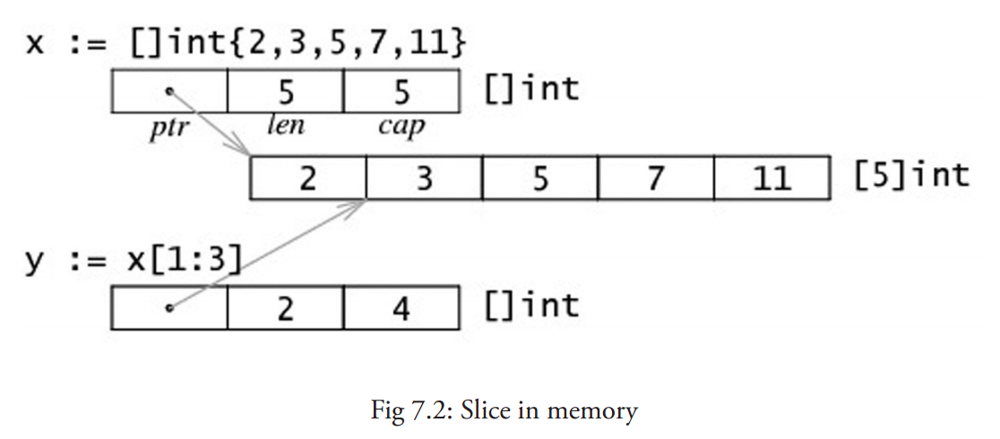
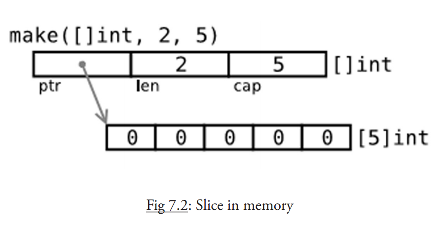
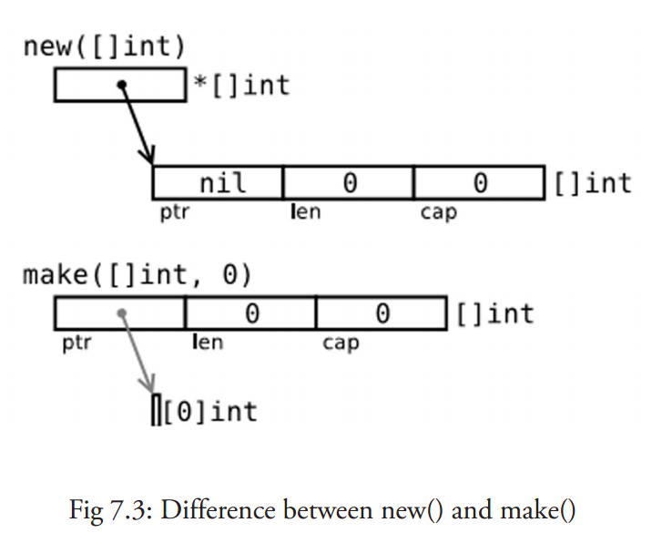

## 第七章 数组与切片

这章我们开始剖析 容器 , 它是可以包含大量条目（item）的数据结构，例如数组、切片和 map。**从这看到 Go 明显受到 Python 的影响。** 以 [] 符号标识的数组类型几乎在所有的编程语言中都是一个基本主力。Go 语言中的数组也是类似的，只是有一些特点。

+ Go 没有 C 那么灵活，但是拥有切片（slice）类型。这是一种建立在 Go 语言数组类型之上的抽象，要想理解切片我们必须先理解数组。

+ 数组有特定的用处，但是却有一些呆板，所以在 Go 语言的代码里并不是特别常见。
+ 相对的，切片却是随处可见的。它们构建在数组之上并且提供更强大的能力和便捷。

### 1 数组声明和初始化

#### 1.1 概念

数组是具有相同 唯一类型 的一组以编号且**长度固定** 的数据项序列（这是一种同构的数据结构）；

1. 这种类型可以是任意的原始类型例如整型、字符串或者自定义类型。
2. 数组长度必须是一个常量表达式，并且必须是一个非负整数。
3. 数组长度也是数组类型的一部分，所以 [5] int 和 [10] int 是属于不同类型的。
4. 数组元素可以通过 **索引**（位置）来读取（或者修改），索引从 0 开始，第一个元素索引为 0，第二个索引为 1，以此类推。
5. 元素的数目，也称为长度或者数组大小必须是固定的并且在声明该数组时就给出（编译时需要知道数组长度以便分配内存）；数组长度最大为 2Gb。

**注意事项** 如果我们想让数组元素类型为任意类型的话可以使用空接口作为类型（参考 [第 11 章](https://learnku.com/docs/the-way-to-go/declarations-and-initialization/11.9.md)）。当使用值时我们必须先做一个类型判断（参考 [第 11 章](https://learnku.com/docs/the-way-to-go/declarations-and-initialization/11.3.md)）。

声明的格式是：

```go
var identifier [len]type
var arr1 [5]int
```

每个元素是一个整型值，当声明数组时所有的元素都会被自动初始化为默认值 0。

+ 每个元素是一个整型值，当声明数组时所有的元素都会被自动初始化为默认值 0。
+ 对索引项为 i 的数组元素赋值可以这么操作：`arr[i] = value`，所以数组是 **可变的**。
+ 只有有效的索引可以被使用，当使用等于或者大于 `len(arr1)` 的索引时：如果编译器可以检测到，会给出索引超限的提示信息；如果检测不到的话编译会通过而运行时会 panic: `runtime error: index out of range`

数组的遍历格式：

```go
for i:=0; i < len(arr1); i++｛
    arr1[i] = ...
}
```

也可以使用 for-range 的生成方式：

```go
for i,_:= range arr1 {
...
}
```

在这里 i 也是数组的索引。当然这两种 for 结构对于切片（slices）（参考 [第 7 章](https://learnku.com/docs/the-way-to-go/declarations-and-initialization/07.2.md)）来说也同样适用。

**问题 7.1** 下面代码段的输出是什么？

```go
a := [...]string{"a", "b", "c", "d"}
for i := range a {
    fmt.Println("Array item", i, "is", a[i])
}

/**
Array item 0 is a
Array item 1 is b
Array item 2 is c
Array item 3 is d
**/
```

Go 语言中的数组是一种 **值类型**（不像 C/C++ 中是指向首元素的指针），所以可以通过 `new()` 来创建：

**`var arr1 = new([5]int)`和 `var arr2 [5]int` 的区别是什么呢？**

+ arr1 的类型是 `*[5]int`
+ 而 arr2 的类型是 `[5]int`

这样的结果就是当把一个数组赋值给另一个时，需要再做一次数组内存的拷贝操作。例如：

```go
arr2 := *arr1
arr2[2] = 100
```

这样两个数组就有了不同的值，在赋值后修改 arr2 不会对 arr1 生效。

+ 所以在函数中数组作为参数传入时，如 `func1(arr2)`，会产生一次数组拷贝，func1 方法不会修改原始的数组 arr2。

+ 如果你想修改原数组，那么 arr2 必须通过 & 操作符以引用方式传过来，例如 func1 (&arr2），下面是一个例子

示例 7.2 [pointer_array.go](https://learnku.com/docs/the-way-to-go/declarations-and-initialization/examples/chapter_7/pointer_array.go):

```go
package main

import "fmt"

func f(a [3]int) {
	fmt.Println(a)
}

func fp(a *[3]int) {
	fmt.Println(a)
}

func main() {
	var ar [3]int
	f(ar)   // passes a copy of ar
	fp(&ar) // passes a pointer to ar
}
```

输出结果：

```php
[0 0 0]
&[0 0 0]
```

另一种方法就是生成数组切片并将其传递给函数（详见第 7.1.4 节）。

练习

练习 7.1：array_value.go: 证明当数组赋值时，发生了数组内存拷贝。

```go
package main

import "fmt"

func f(nums [3]int) {
	for i := range nums {
		fmt.Printf("the value on the index %d and the memory postion: %d\n", i, &nums[i])
	}
}

func main() {
	var nums [3]int
	for i := range nums {
		fmt.Printf("the value on the index %d and the memory postion: %d\n", i, &nums[i])
	}

	f(nums)
}

/**
the value on the index 0 and the memory postion: 824634867712
the value on the index 1 and the memory postion: 824634867720
the value on the index 2 and the memory postion: 824634867728
the value on the index 0 and the memory postion: 824634867760
the value on the index 1 and the memory postion: 824634867768
the value on the index 2 and the memory postion: 824634867776
**/

```

```go
package main

import "fmt"

func main() {
	var arr1 [5]int

	for i := 0; i < len(arr1); i++ {
		arr1[i] = i * 2
	}

	arr2 := arr1
	arr2[2] = 100

	for i := 0; i < len(arr1); i++ {
		fmt.Printf("Array arr1 at index %d is %d\n", i, arr1[i])
	}
	fmt.Println()
	for i := 0; i < len(arr2); i++ {
		fmt.Printf("Array arr2 at index %d is %d\n", i, arr2[i])
	}
}

/**
Array arr1 at index 0 is 0
Array arr1 at index 1 is 2
Array arr1 at index 2 is 4
Array arr1 at index 3 is 6
Array arr1 at index 4 is 8

Array arr2 at index 0 is 0
Array arr2 at index 1 is 2
Array arr2 at index 2 is 100
Array arr2 at index 3 is 6
Array arr2 at index 4 is 8
**/
```

练习 7.2：for_array.go: 写一个循环并用下标给数组赋值（从 0 到 15）并且将数组打印在屏幕上。

```go
package main

import "fmt"

func mainForArray() {
	var arr [15]int
	for i := 0; i < len(arr); i++ {
		arr[i] = i
	}
	fmt.Println(arr)
}
// [0 1 2 3 4 5 6 7 8 9 10 11 12 13 14]
```

练习 7.3：fibonacci_array.go: 在第 6.6 节我们看到了一个递归计算 Fibonacci 数值的方法。但是通过数组我们可以更快的计算出 Fibonacci 数。完成该方法并打印出前 50 个 Fibonacci 数字。

```go
package main

import "fmt"

var fibs [50]int64

func main() {
	fibs[0] = 1
	fibs[1] = 1

	for i := 2; i < 50; i++ {
		fibs[i] = fibs[i-1] + fibs[i-2]
	}

	for i := 0; i < 50; i++ {
		fmt.Printf("The %d-th Fibonacci number is: %d\n", i, fibs[i])
	}
}
```


#### 1.2 数组常量

如果数组值已经提前知道了，那么可以通过 **数组常量** 的方法来初始化数组，而不用依次使用 `[]=` 方法（所有的组成元素都有相同的常量语法）。

示例 7.3 [array_literals.go](https://learnku.com/docs/the-way-to-go/declarations-and-initialization/examples/chapter_7/array_literals.go)

```go
package main
import "fmt"

func main() {
    // var arrAge = [5]int{18, 20, 15, 22, 16}
    // var arrLazy = [...]int{5, 6, 7, 8, 22} 
    var arrKeyValue = [5]string{3: "Chris", 4: "Ron"}

    for i:=0; i < len(arrKeyValue); i++ {
        fmt.Printf("Person at %d is %s\n", i, arrKeyValue[i])
    }
}
```

1. `var arrAge = [5]int{18, 20, 15, 22, 16}` ，注意 `[5]int` 可以从左边起开始忽略：`[10]int {1, 2, 3}` : 这是一个有 10 个元素的数组，除了前三个元素外其他元素都为 0。
2. `var arrLazy = [...]int{5, 6, 7, 8, 22}`, `...` 可同样可以忽略，从技术上说它们其实变化成了切片。
3. `var arrKeyValue = [5]string{3: "Chris", 4: "Ron"}`  只有索引 3 和 4 被赋予实际的值，其他元素都被设置为空的字符串，在这里数组长度同样可以写成 `...` 或者直接忽略。

你可以取任意数组常量的地址来作为指向新实例的指针。

示例 7.4 [pointer_array2.go](https://learnku.com/docs/the-way-to-go/declarations-and-initialization/examples/chapter_7/pointer_array2.go)

```go
package main

import "fmt"

func fp2(a *[3]int) {
	fmt.Println(a)
}

func main() {
	for i := 0; i < 3; i++ {
		fp2(&[3]int{i, i * i, i * i * i})
	}
}

/**
&[0 0 0]
&[1 1 1]
&[2 4 8]
**/
```

几何点（或者数学向量）是一个使用数组的经典例子。为了简化代码通常使用一个别名：

```go
type Vector3D [3]float32
var vec Vector3D
```


#### 1.3 多维数组

数组通常是一维的，但是可以用来组装成多维数组，例如：`[3][5]int`，`[2][2][2]float64`。

内部数组总是长度相同的。Go 语言的多维数组是矩形式的（唯一的例外是切片的数组，参见第 7.2.5 节）。

示例 7.5 [multidim_array.go](https://learnku.com/docs/the-way-to-go/declarations-and-initialization/examples/chapter_7/multidim_array.go)

```go
package main
const (
    WIDTH  = 1920
    HEIGHT = 1080
)

type pixel int
var screen [WIDTH][HEIGHT]pixel

func main() {
    for y := 0; y < HEIGHT; y++ {
        for x := 0; x < WIDTH; x++ {
            screen[x][y] = 0
        }
    }
}
```


#### 1.4 将数组传递给函数

把一个大数组传递给函数会消耗很多内存。有两种方法可以避免这种现象：

- 传递数组的指针
- 使用数组的切片

**接下来的例子阐明了第一种方法，即如何使用指针避免拷贝：**

示例 7.6 [array_sum.go](https://learnku.com/docs/the-way-to-go/declarations-and-initialization/examples/chapter_7/array_sum.go)

```go
package main
import "fmt"

func main() {
    array := [3]float64{7.0, 8.5, 9.1}
    x := Sum(&array) // Note the explicit address-of operator
    // to pass a pointer to the array
    fmt.Printf("The sum of the array is: %f", x)
}

func Sum(a *[3]float64) (sum float64) {
    for _, v := range *a { // derefencing *a to get back to the array is not necessary!
        sum += v
    }
    return
}
```

输出结果：

```php
The sum of the array is: 24.600000
```

但这在 Go 中并不常用，通常使用切片（参考 [第 7.2 节](https://learnku.com/docs/the-way-to-go/declarations-and-initialization/07.2.md)）。


### 2 切片

#### 2.1 概念

**切片（slice）是对数组一个连续片段的引用（该数组我们称之为相关数组，通常是匿名的）** ，所以切片是一个引用类型（因此更类似于 C/C++ 中的数组类型，或者 Python 中的 list 类型）。

切片的相关特性：

1. 这个片段可以是整个数组，或者是由起始和终止索引标识的一些项的子集。

2. 切片是可索引的，并且可以由 `len()` 函数获取长度。

3. 和数组不同的是，切片的长度可以在运行时修改，最小为 0 最大为相关数组的长度：切片是一个 **长度可变的数组**。

4. 切片提供了计算容量的函数 cap() 可以测量切片最长可以达到多少：它等于切片从第一个元素开始，到相关数组末尾的元素个数。

   + 如果 s 是一个切片，cap(s) 就是从 s[0] 到数组末尾的数组长度。

   + 切片的长度永远不会超过它的容量，所以对于 切片 s 来说该不等式永远成立：0 <= len(s) <= cap(s)。

5. 多个切片如果表示同一个数组的片段，它们可以共享数据；因此一个切片和相关数组的其他切片是共享存储的，相反，不同的数组总是代表不同的存储。数组实际上是切片的构建块。

**优点** 

+ 因为切片是引用，所以它们不需要使用额外的内存并且比使用数组更有效率，所以在 Go 代码中 切片比数组更常用。

**声明切片的格式是： `var identifier []type`（不需要说明长度）。**

+ 一个切片在未初始化之前默认为 nil，长度为 0。
+ 切片的初始化格式是：`var slice1 []type = arr1[start:end]`。
  + 这表示 slice1 是由数组 arr1 从 start 索引到 end-1 索引之间的元素构成的子集（切分数组，start:end 被称为 slice 表达式）。所以 slice1[0] 就等于 arr1[start]。
  + 这可以在 arr1 被填充前就定义好。

如果某个人写：`var slice1 []type = arr1[:]` 那么 slice1 就等于完整的 arr1 数组（所以这种表示方式是 `arr1[0:len(arr1)]` 的一种缩写）。另外一种表述方式是：`slice1 = &arr1`。

切片也可以用类似数组的方式初始化：`var x = []int{2, 3, 5, 7, 11}`。这样就创建了一个长度为 5 的数组并且创建了一个相关切片。

+ 切片在内存中的组织方式实际上是一个有 3 个域的结构体：指向相关数组的指针，切片长度以及切片容量。下图给出了一个长度为 2，容量为 4 的切片 y。
+ `y[0] = 3` 且 `y[1] = 5`。
+ 切片 `y[0:4]` 由 元素 3，5，7, 11 组成。



示例 7.7 [array_slices.go](https://learnku.com/docs/the-way-to-go/72-slice/examples/chapter_7/array_slices.go)

```go
package main
import "fmt"

func main() {
    var arr1 [6]int
    var slice1 []int = arr1[2:5] // item at index 5 not included!

    // load the array with integers: 0,1,2,3,4,5
    for i := 0; i < len(arr1); i++ {
        arr1[i] = i
    }

    // print the slice
    for i := 0; i < len(slice1); i++ {
        fmt.Printf("Slice at %d is %d\n", i, slice1[i])
    }

    fmt.Printf("The length of arr1 is %d\n", len(arr1))
    fmt.Printf("The length of slice1 is %d\n", len(slice1))
    fmt.Printf("The capacity of slice1 is %d\n", cap(slice1))

    // grow the slice
    slice1 = slice1[0:4]
    for i := 0; i < len(slice1); i++ {
        fmt.Printf("Slice at %d is %d\n", i, slice1[i])
    }
    fmt.Printf("The length of slice1 is %d\n", len(slice1))
    fmt.Printf("The capacity of slice1 is %d\n", cap(slice1))

    // grow the slice beyond capacity
    //slice1 = slice1[0:7 ] // panic: runtime error: slice bound out of range
}
```

输出：

```
Slice at 0 is 2  
Slice at 1 is 3  
Slice at 2 is 4  
The length of arr1 is 6  
The length of slice1 is 3  
The capacity of slice1 is 4  
Slice at 0 is 2  
Slice at 1 is 3  
Slice at 2 is 4  
Slice at 3 is 5  
The length of slice1 is 4  
The capacity of slice1 is 4  
```

如果 s2 是一个 slice，你可以将 s2 向后移动一位 s2 = s2[1:]，但是末尾没有移动。切片只能向后移动，s2 = s2[-1:] 会导致编译错误。切片不能被重新分片以获取数组的前一个元素。

**注意 绝对不要用指针指向 slice。切片本身已经是一个引用类型，所以它本身就是一个指针！！**

**问题 7.2： 给定切片 b:= []byte{'g', 'o', 'l', 'a', 'n', 'g'}，那么 b[1:4]、b[:2]、b[2:] 和 b[:] 分别是什么？**

1. `b[1:4]` 是 `[]byte{'o', 'l', 'a'}``
2. ``b[:2]` 是 `[]byte{'g', 'o'}`
3. b[2:]` 是 `[]byte{'l', 'a', 'n', 'g'}
4. ``b[:]` 是 `[]byte{'g', 'o', 'l', 'a', 'n', 'g'}`


#### 2.2 将切片传递给函数

如果你有一个函数需要对数组做操作，你可能总是需要把参数声明为切片。**当你调用该函数时，把数组分片，创建为一个切片引用并传递给该函数。** 这里有一个计算数组元素和的方法:

```go
func sum(a []int) int {
    s := 0
    for i := 0; i < len(a); i++ {
        s += a[i]
    }
    return s
}

func main() {
    var arr = [5]int{0, 1, 2, 3, 4}
    sum(arr[:])
}
```


#### 2.3 用 make() 创建一个切片

当相关数组还没有定义时，我们可以使用 make () 函数来创建一个切片同时创建好相关数组：`var slice1 []type = make([]type, len)`。

+ 也可以简写为 `slice1 := make([]type, len)`，这里 len 是数组的长度并且也是 slice 的初始长度。

+ 所以定义 `s2 := make([]int, 10)`，那么 `cap(s2) == len(s2) == 10`。

+ make 接受 2 个参数：元素的类型以及切片的元素个数。

如果你想创建一个 slice1，它不占用整个数组，而只是占用以 len 为个数个项，那么只要：`slice1 := make([]type, len, cap)`。

+ make 的使用方式是：`func make([]T, len, cap)`，其中 cap 是可选参数。

所以下面两种方法可以生成相同的切片:

```go
make([]int, 50, 100)
new([100]int)[0:50]
```

下图描述了使用 make 方法生成的切片的内存结构：



示例 7.8 [make_slice.go](https://learnku.com/docs/the-way-to-go/72-slice/examples/chapter_7/make_slice.go)

```go
package main
import "fmt"

func main() {
    var slice1 []int = make([]int, 10)
    // load the array/slice:
    for i := 0; i < len(slice1); i++ {
        slice1[i] = 5 * i
    }

    // print the slice:
    for i := 0; i < len(slice1); i++ {
        fmt.Printf("Slice at %d is %d\n", i, slice1[i])
    }
    fmt.Printf("\nThe length of slice1 is %d\n", len(slice1))
    fmt.Printf("The capacity of slice1 is %d\n", cap(slice1))
}
/**
0-index's number is 0
1-index's number is 1
2-index's number is 4
3-index's number is 9
4-index's number is 16
5-index's number is 25
6-index's number is 36
7-index's number is 49
8-index's number is 64
9-index's number is 81

The length of slice1 is 10
The capacity of slice1 is 10
**/
```

因为字符串是纯粹不可变的字节数组，它们也可以被切分成 切片。

**练习 7.4： fobinacci_funcarray.go: 为练习 7.3 写一个新的版本，主函数调用一个使用序列个数作为参数的函数，该函数返回一个大小为序列个数的 Fibonacci 切片。**

```go
package main

import "fmt"

func mainGetFibonacci() {
	res := getFibonacci(5)
	fmt.Println(res)
}

func getFibonacci(n int) (res []int) {
	res = make([]int, n)
	res[0] = 1
	res[1] = 1
	for i := 2; i < n; i++ {
		res[i] = res[i-2] + res[i-1]
	}
	return res
}
```


#### 2.4 new() 和 make() 的区别

看起来二者没有什么区别，都在堆上分配内存，但是它们的行为不同，适用于不同的类型。

+ new (T) 为每个新的类型 T 分配一片内存，初始化为 0 并且返回类型为 * T 的内存地址：
  + 这种方法 返回一个指向类型为 T，值为 0 的地址的指针，
  + 它适用于值类型如数组和结构体（参见第 10 章）；**它相当于 &T{}。**

- make(T) **返回一个类型为 T 的初始值**
  - 它只适用于 3 种内建的引用类型：切片、map 和 channel（参见第 8 章，第 13 章）。

**换言之，new 函数分配内存，make 函数初始化；下图给出了区别：**



在图 7.3 的第一幅图中：

```go
var p *[]int = new([]int) // *p == nil; with len and cap 0
p := new([]int)
```

在第二幅图中， `p := make([]int, 0)` ，切片 已经被初始化，但是指向一个空的数组。

**以上两种方式实用性都不高。下面的方法：**

```go
var v []int = make([]int, 10, 50)
v := make([]int, 10, 50)
```

这样分配一个有 50 个 int 值的数组，并且创建了一个长度为 10，容量为 50 的 切片 v，该 切片 指向数组的前 10 个元素。

**问题 7.3 给定 s := make([]byte, 5)，len (s) 和 cap (s) 分别是多少？s = s[2:4]，len (s) 和 cap (s) 又分别是多少？**

1. 对于 s := make([]byte, 5)： len(s) = 5， cap(s) = 5
2. 对于 s = s[2:4] ，len(s) = 2, cap(s) = 3

**问题 7.4 假设 s1 := []byte{'p', 'o', 'e', 'm'} 且 s2 := s1[2:]，s2 的值是多少？如果我们执行 s2[1] = 't'，s1 和 s2 现在的值又分别是多少？**

1. s2 = ['e', 'm']
2. 执行 s2[1] = 't', s1 = {'p', 'o', 'e', 't'}, s2 = ['e', 't']


#### 2.5 多维切片

和数组一样，切片通常也是一维的，但是也可以由一维组合成高维。通过分片的分片（或者切片的数组），长度可以任意动态变化，所以 Go 语言的多维切片可以任意切分。而且，内层的切片必须单独分配（通过 make 函数）。


#### 2.6 bytes 包

类型 `[]byte` 的切片十分常见，Go 语言有一个 bytes 包专门用来解决这种类型的操作方法。

bytes 包和字符串包十分类似（参见第 4.7 节）。而且它还包含一个十分有用的类型 Buffer:

```go
import "bytes"

type Buffer struct {
    ...
}
```

这是一个长度可变的 bytes 的 buffer，提供 Read 和 Write 方法，读写长度未知的 bytes 最好使用 buffer。

+ Buffer 可以这样定义：`var buffer bytes.Buffer`。

+ 或者使用 new 获得一个指针：`var r *bytes.Buffer = new(bytes.Buffer)`。

+ 或者通过函数：`func NewBuffer(buf []byte) *Buffer`，创建一个 Buffer 对象并且用 buf 初始化好；NewBuffer 最好用在从 buf 读取的时候使用。

**通过 buffer 串联字符串**

类似于 Java 的 StringBuilder 类。

在下面的代码段中，我们创建一个 buffer，通过 `buffer.WriteString(s)` 方法将字符串 s 追加到后面，最后再通过 `buffer.String()` 方法转换为 string：

```go
var buffer bytes.Buffer
for {
    if s, ok := getNextString(); ok { //method getNextString() not shown here
        buffer.WriteString(s)
    } else {
        break
    }
}
fmt.Print(buffer.String(), "\n")
```

这种实现方式比使用 `+=` 要更节省内存和 CPU，尤其是要串联的字符串数目特别多的时候。

**练习 7.5 给定切片 sl，将一个 []byte 数组追加到 sl 后面。写一个函数 Append(slice, data []byte) []byte，该函数在 sl 不能存储更多数据的时候自动扩容。**

```go
package main

import "fmt"

func main() {
	sl := []byte{1, 2, 3}
	data := []byte{4, 5, 6}
	sl = Append(sl, data)
	fmt.Println(sl)

	sl = make([]byte, 0, 6)
	sl = Append(sl, data)
	fmt.Println(sl)
}

func Append(sl, data []byte) []byte {
	newLen := len(sl) + len(data)
	if newLen > cap(sl) {
		newSl := make([]byte, newLen)
		copy(newSl, sl)
		copy(newSl[len(sl):], data)
		return newSl
	}
	sl = sl[:newLen]
	copy(sl[len(sl)-len(data):], data)
	return sl
}

/**
[1 2 3 4 5 6]
[4 5 6]
**/
```

**练习 7.6 把一个缓存 buf 分片成两个 切片：第一个是前 n 个 bytes，后一个是剩余的，用一行代码实现。**

```go
part1, part2 = buf[:n], buf[n:]
```


### 3 For-range 结构

这种构建方法可以应用于数组和切片:

```go
for ix, value := range slice1 {
    ...
}
```

第一个返回值 ix 是数组或者切片的索引，第二个是在该索引位置的值；他们都是仅在 for 循环内部可见的局部变量。**value 只是 slice1 某个索引位置的值的一个拷贝，不能用来修改 slice1 该索引位置的值。**
示例 7.10 [slices_forrange2.go](https://learnku.com/docs/the-way-to-go/73-for-range-structure/examples/chapter_7/slices_forrange2.go)

```go
package main
import "fmt"

func main() {
    seasons := []string{"Spring", "Summer", "Autumn", "Winter"}
    for ix, season := range seasons {
        fmt.Printf("Season %d is: %s\n", ix, season)
    }

    var season string
    for _, season = range seasons {
        fmt.Printf("%s\n", season)
    }
}

/**
Season 0 is: Spring
Season 1 is: Summer
Season 2 is: Autumn
Season 3 is: Winter
Spring
Summer
Autumn
Winter
**/
```

slices_forrange2.go 给出了一个关于字符串的例子， _ 可以用于忽略索引。

如果你只需要索引，你可以忽略第二个变量；如果你需要修改 `seasons[ix]` 的值也可以使用这个版本。例如：

```go
for ix := range seasons {
    fmt.Printf("%d", ix)
}
// Output: 0 1 2 3
```

**多维切片下的 for-range：**

通过计算行数和矩阵值可以很方便的写出如（参考第 7.1.3 节）的 for 循环来，例如（参考第 7.5 节的例子 multidim_array.go）：

```go
for row := range screen {
    for column := range screen[row] {
        screen[row][column] = 1
    }
}
```

**问题 7.5 假设我们有如下数组：items := [...]int{10, 20, 30, 40, 50}**

a) 如果我们写了如下的 for 循环，那么执行完 for 循环后的 items 的值是多少？如果你不确定的话可以测试一下

```go
for _, item := range items {
    item *= 2
}
```

b) 如果 a) 无法正常工作，写一个 for 循环让值可以 double。

```go
for ix := range items {
    item[ix] *= 2
}
```

**问题 7.6 通过使用省略号操作符 ... 来实现累加方法。**

```go
package main

import "fmt"

// Sum 函数接受一个int类型的切片，并返回它们的和。
func Sum(nums ...int) int {
	total := 0
	for _, num := range nums {
		total += num
	}
	return total
}

func main() {
	// 调用Sum函数并传递一个int类型的切片
	nums := []int{1, 2, 3, 4, 5}
	result := Sum(nums...)
	fmt.Println("The sum is:", result) // 输出：The sum is: 15
}

```

**练习 7.7 sum_array.go**

a) 编写一个函数 Sum，其参数是一个包含 4 个浮点数的数组 arrF，并返回数组中所有数字的总和。如果使用切片而不是数组，代码要如何修改？该函数的切片形式适用于不同长度的数组！

b) 编写一个函数 SumAndAverage，将这两个未命名的 int 和 float32 类型的变量返回。

```go
package main

import "fmt"

func main() {
	// var a = [4]float32 {1.0,2.0,3.0,4.0}
	var a = []float32{1.0, 2.0, 3.0, 4.0}
	fmt.Printf("The sum of the array is: %f\n", Sum2(a))

	var b = []int{1, 2, 3, 4, 5}
	sum, average := SumAndAverage(b)
	fmt.Printf("The sum of the array is: %d, and the average is: %f", sum, average)
}

func Sum2(nums []float32) (res float32) {
	for _, val := range nums {
		res += val
	}
	return
}

func SumAndAverage(nums []int) (sum int, avg float32) {
	for _, val := range nums {
		sum += val
	}
	avg = float32(sum / len(nums))
	return
}

/**
The sum of the array is: 10.000000
The sum of the array is: 15, and the average is: 3.000000
**/
```

**练习 7.8 min_max.go**

写一个 minSlice 方法，传入一个 int 的切片并且返回最小值，再写一个 maxSlice 方法返回最大值。

```go
package main

import (
	"fmt"
	"math"
)

func mainMinMax() {
	sl1 := []int{78, 34, 643, 12, 90, 492, 13, 2}
	max := maxSlice(sl1)
	fmt.Printf("The maximum is %d\n", max)
	min := minSlice(sl1)
	fmt.Printf("The minimum is %d\n", min)
}

func maxSlice(sl []int) (max int) {
	for _, v := range sl {
		if v > max {
			max = v
		}
	}
	return
}

func minSlice(sl []int) (min int) {
	min = math.MaxInt32
	for _, v := range sl {
		if v < min {
			min = v
		}
	}
	return
}

/* Output:
The maximum is 643
The minimum is 2
*/
```


### 4 切片重组（reslice）

我们已经知道切片创建的时候通常比相关数组小，例如：

```go
slice1 := make([]type, start_length, capacity)
```

其中 `start_length` 作为切片初始长度而 `capacity` 作为相关数组的长度。

**这么做的好处是我们的切片在达到容量上限后可以扩容**。 改变切片长度的过程称之为切片重组 reslicing，做法如下：slice1 = slice1[0:end]，其中 end 是新的末尾索引（即长度）。

将切片扩展 1 位可以这么做：

```go
sl = sl[0:len(sl)+1]
```

切片可以反复扩展直到占据整个相关数组。

示例 7.11 [reslicing.go](https://learnku.com/docs/the-way-to-go/74-slice-recombination-reslice/examples/chapter_7/reslicing.go)

```go
package main
import "fmt"

func main() {
    slice1 := make([]int, 0, 10)
    // load the slice, cap(slice1) is 10:
    for i := 0; i < cap(slice1); i++ {
        slice1 = slice1[0:i+1]
        slice1[i] = i
        fmt.Printf("The length of slice is %d\n", len(slice1))
    }

    // print the slice:
    for i := 0; i < len(slice1); i++ {
        fmt.Printf("Slice at %d is %d\n", i, slice1[i])
    }
}

/**
The length of slice is 1
The length of slice is 2
The length of slice is 3
...
Slice at 0 is 0
...
**/
```

另一个例子：

```go
var ar = [10]int{0,1,2,3,4,5,6,7,8,9}
var a = ar[5:7] // reference to subarray {5,6} - len(a) is 2 and cap(a) is 5
```

将 a 重新分片：

```go
a = a[0:4] // ref of subarray {5,6,7,8} - len(a) is now 4 but cap(a) is still 5
```

**问题 7.7**

1) 如果 s 是一个切片，那么 `s[n:n]` 的长度是多少？ -> len(s) = 0

2. `s[n:n+1]` 的长度又是多少？-> len(s) = 1


### 5 切片的复制与追加

如果想增加切片的容量，我们必须创建一个新的更大的切片并把原分片的内容都拷贝过来。下面的代码描述了从拷贝切片的 copy 函数和向切片追加新元素的 append 函数。

示例 7.12 [copy_append_slice.go](https://learnku.com/docs/the-way-to-go/duplication-and-addition-of-75-slices/examples/chapter_7/copy_append_slice.go)

```go
package main
import "fmt"

func main() {
    sl_from := []int{1, 2, 3}
    sl_to := make([]int, 10)

    n := copy(sl_to, sl_from)
    fmt.Println(sl_to)
    fmt.Printf("Copied %d elements\n", n) // n == 3

    sl3 := []int{1, 2, 3}
    sl3 = append(sl3, 4, 5, 6)
    fmt.Println(sl3)
}
```

append 函数

+ `func append(s[]T, x ...T) []T` 其中 append 方法将 0 个或多个具有相同类型 s 的元素追加到切片后面并且返回新的切片；追加的元素必须和原切片的元素同类型。
+ 如果 s 的容量不足以存储新增元素，append 会分配新的切片来保证已有切片元素和新增元素的存储。因此，返回的切片可能已经指向一个不同的相关数组了。

+ append 方法总是返回成功，除非系统内存耗尽了。

+ 如果你想将切片 y 追加到切片 x 后面，只要将第二个参数扩展成一个列表即可：`x = append(x, y...)`。

**注意**： append 在大多数情况下很好用，但是如果你想完全掌控整个追加过程，你可以实现一个这样的 AppendByte 方法：

```go
func AppendByte(slice []byte, data ...byte) []byte {
    m := len(slice)
    n := m + len(data)
    if n > cap(slice) { // if necessary, reallocate
        // allocate double what's needed, for future growth.
        newSlice := make([]byte, (n+1)*2)
        copy(newSlice, slice)
        slice = newSlice
    }
    slice = slice[0:n]
    copy(slice[m:n], data)
    return slice
}
```

`func copy(dst, src []T) int copy `方法将类型为 T 的切片从源地址 src 拷贝到目标地址 dst，覆盖 dst 的相关元素，并且返回拷贝的元素个数。

+ 源地址和目标地址可能会有重叠。
+ 拷贝个数是 src 和 dst 的长度最小值。
+ 如果 src 是字符串那么元素类型就是 byte。

**练习 7.9 magnify_slice.go**

给定 slice s[]int 和一个 int 类型的因子 factor，扩展 s 使其长度为 len(s) * factor。

```go
package main

import "fmt"

var s []int

func main() {
	s = []int{1, 2, 3}
	fmt.Println("The length of s before enlarging is:", len(s))
	fmt.Println(s)

	s = enlarge(s, 5)
	fmt.Println("The length of s after enlarging is:", len(s))
	fmt.Println(s)
}

func enlarge(s []int, factor int) []int {
	ns := make([]int, len(s)*factor)
	// fmt.Println("The length of ns  is:", len(ns))
	copy(ns, s)
	s = ns
	return s
}

/**
The length of s before enlarging is: 3
[1 2 3]
The length of s after enlarging is: 15
[1 2 3 0 0 0 0 0 0 0 0 0 0 0 0]
**/
```

**练习 7.10 filter_slice.go**

使用高阶函数对一个集合进行过滤：s 是前 10 个整数的一个切片。建立一个函数 Filter，它接受 s 作为第一参数，fn func (int) bool 作为第二参数，并返回满足函数 fn 的 s 元素的切片（使其为真）。用 fn 测试整数是否为偶数。

```go
package main

import "fmt"

func main() {
	s := []int{0, 1, 2, 3, 4, 5, 6, 7, 8, 9}
	s = Filter(s, even)
	fmt.Println(s)
}

func Filter(s []int, fn func(int) bool) []int {
	var p []int
	for _, val := range s {
		if fn(val) {
			p = append(p, val)
		}
	}
	return p
}

func even(val int) bool {
	if val%2 == 0 {
		return true
	}
	return false
}

/**
[0 2 4 6 8]
**/
```

**练习 7.11 insert_slice.go**

编写一个函数 InsertStringSlice 将切片插入到另一个切片的指定位置。

```go
package main

import "fmt"

func main() {
	s := []string{"M", "N", "O", "P", "Q", "R"}
	in := []string{"A", "B", "C"}
	res := InsertStringSlice(s, in, 0) // at the front
	fmt.Println(res)                   // [A B C M N O P Q R]

	fmt.Println()
	res = InsertStringSlice(s, in, 3) // [M N O A B C P Q R]
	fmt.Println(res)
}

func InsertStringSlice(slice, insertion []string, index int) []string {
	result := make([]string, len(slice)+len(insertion))
	at := copy(result, slice[:index])
	fmt.Println("the first step: ", result)
	at += copy(result[index:], insertion)
	fmt.Println("the second step: ", result)
	copy(result[at:], slice[index:])
	fmt.Println("the last step: ", result)
	return result
}
/**
the first step:  [        ]
the second step:  [A B C      ]
the last step:  [A B C M N O P Q R]
[A B C M N O P Q R]

the first step:  [M N O      ]
the second step:  [M N O A B C   ]
the last step:  [M N O A B C P Q R]
[M N O A B C P Q R]
**/
```

**练习 7.12 remove_slice.go**

编写一个函数 RemoveStringSlice 将从 start 到 end 索引的元素从切片 中移除。

```go
package main

import "fmt"

func main() {
	s := []string{"M", "N", "O", "P", "Q", "R"}
	res := RemoveStringSlice(s, 2, 4)
	fmt.Println(res) // [M N Q R]
}

func RemoveStringSlice(slice []string, start, end int) []string {
	result := make([]string, len(slice)-(end-start))
	at := copy(result, slice[:start])
	copy(result[at:], slice[end:])
	return result
}

/**
[M N Q R]
**/
```


### 6 字符串、数组和切片的应用

#### 6.1 从字符串生成字节切片

假设 s 是一个字符串（本质上是一个字节数组），那么就可以直接通过 `c := []byte(s)` 来获取一个字节数组的切片 c。另外，您还可以通过 copy 函数来达到相同的目的：`copy(dst []byte, src string)`。

同样的，还可以使用 for-range 来获得每个元素（Listing 7.13—for_string.go）：

```go
package main

import "fmt"

func main() {
    s := "\u00ff\u754c"
    for i, c := range s {
        fmt.Printf("%d:%c ", i, c)
    }
}
/**
0:ÿ 2:界
**/
```

我们知道，Unicode 字符会占用 2 个字节，有些甚至需要 3 个或者 4 个字节来进行表示。如果发现错误的 UTF8 字符，则该字符会被设置为 U+FFFD 并且索引向前移动一个字节。 

+ 和字符串转换一样，您同样可以使用` c := []int32(s) 语法`，这样切片中的每个 int 都会包含对应的 Unicode 代码，因为字符串中的每次字符都会对应一个整数。类似的，您也可以将字符串转换为元素类型为 rune 的切片：`r := []rune(s)`。
+ 可以通过代码 len([]int32(s)) 来获得字符串中字符的数量，但使用 utf8.RuneCountInString(s) 效率会更高一点

您还可以将一个字符串追加到某一个字符数组的尾部：

```go
var b []byte
var s string
b = append(b, s...)
```


#### 6.2 获取字符串的某一部分

使用 substr := str[start:end] 可以从字符串 str 获取到从索引 start 开始到 end-1 位置的子字符串。

同样的：

+ str[start:] 则表示获取从 start 开始到 len(str)-1 位置的子字符串
+  str[:end] 表示获取从 0 开始到 end-1 的子字符串。


#### 6.3 字符串和切片的内存结构

在内存中，一个字符串实际上是一个双字结构，即一个指向实际数据的指针和记录字符串长度的整数（见图 7.4）。因为指针对用户来说是完全不可见，因此我们可以依旧把字符串看做是一个值类型，也就是一个字符数组。

字符串 `string s = "hello"` 和子字符串 `t = s[2:3]` 在内存中的结构可以用下图表示：


#### 6.4 修改字符串中的某个字符

Go 语言中的字符串是不可变的，也就是说 `str[index]` 这样的表达式是不可以被放在等号左侧的。如果尝试运行 `str[i] = 'D'` 会得到错误：`cannot assign to str[i]`。

因此，您必须先将字符串转换成字节数组，然后再通过修改数组中的元素值来达到修改字符串的目的，最后将字节数组转换回字符串格式。

例如，将字符串 “hello” 转换为 “cello”：

```go
s := "hello"
c := []byte(s)
c[0] = 'c'
s2 := string(c) // s2 == "cello"
```

所以，您可以通过操作切片来完成对字符串的操作。


#### 6.5 字节数组对比函数

下面的 `Compare` 函数会返回两个字节数组字典顺序的整数对比结果，即 `0 if a == b, -1 if a < b, 1 if a > b`。

```go
func Compare(a, b[]byte) int {
    for i:=0; i < len(a) && i < len(b); i++ {
        switch {
        case a[i] > b[i]:
            return 1
        case a[i] < b[i]:
            return -1
        }
    }
    // 数组的长度可能不同
    switch {
    case len(a) < len(b):
        return -1
    case len(a) > len(b):
        return 1
    }
    return 0 // 数组相等
}
```


#### 6.6 搜索及排序切片和数组

标准库提供了 sort 包来实现常见的搜索和排序操作。

+ 您可以使用 sort 包中的函数 `func Ints(a []int) `来实现对 int 类型的切片排序。
  + 例如 `sort.Ints(arri)`，其中变量 arri 就是需要被升序排序的数组或切片。
+ 为了检查某个数组是否已经被排序，可以通过函数 `IntsAreSorted(a []int) bool` 来检查，如果返回 true 则表示已经被排序。

+ 类似的，可以使用函数 `func Float64s(a []float64)` 来排序 float64 的元素，或使用函数 `func Strings(a []string)` 排序字符串元素。

想要在数组或切片中搜索一个元素，该数组或切片必须先被排序（因为标准库的搜索算法使用的是二分法）。然后，您就可以使用函数 `func SearchInts(a []int, n int) int` 进行搜索，并返回对应结果的索引值。

当然，还可以搜索 float64 和字符串：

```go
func SearchFloat64s(a []float64, x float64) int
func SearchStrings(a []string, x string) int
```

这就是如何使用 `sort` 包的方法，我们会在第 11.6 节对它的细节进行深入，并实现一个属于我们自己的版本


#### 6.7 append 函数常见操作

我们在第 7.5 节提到的 append 非常有用，它能够用于各种方面的操作：

1. 将切片 b 的元素追加到切片 a 之后：`a = append(a, b...)`
2. 复制切片 a 的元素到新的切片 b 上：` copy(b, a)`
3. 删除位于索引 i 的元素：`a = append(a[:i], a[i+1:]...)`
4. 切除切片 a 中从索引 i 至 j 位置的元素：`a = append(a[:i], a[j:]...)`
5. 为切片 a 扩展 j 个元素长度：`a = append(a, make([]T, j)...)`
6. 在索引 i 的位置插入元素 x：`a = append(a[:i], append([]T{x}, a[i:]...)...)`
7. 在索引 i 的位置插入长度为 j 的新切片：`a = append(a[:i], append(make([]T, j), a[i:]...)...)`
8. 在索引 i 的位置插入切片 b 的所有元素：`a = append(a[:i], append(b, a[i:]...)...)`
9. 取出位于切片 a 最末尾的元素 x：`x, a = a[len(a)-1:], a[:len(a)-1]`
10. 将元素 x 追加到切片 a：`a = append(a, x)`

因此，您可以使用切片和 append 操作来表示任意可变长度的序列。

从数学的角度来看，切片相当于向量，如果需要的话可以定义一个向量作为切片的别名来进行操作。

如果您需要更加完整的方案，可以学习一下 Eleanor McHugh 编写的几个包：[slices](https://github.com/feyeleanor/slices)、[chain](https://github.com/feyeleanor/chain) 和 [lists](https://github.com/feyeleanor/lists)。。


#### 6.8 切片和垃圾回收

切片的底层指向一个数组，该数组的实际容量可能要大于切片所定义的容量。只有在没有任何切片指向的时候，底层的数组内存才会被释放，这种特性有时会导致程序占用多余的内存。

**示例** 函数 `FindDigits` 将一个文件加载到内存，然后搜索其中所有的数字并返回一个切片。

```go
var digitRegexp = regexp.MustCompile("[0-9]+")

func FindDigits(filename string) []byte {
    b, _ := ioutil.ReadFile(filename)
    return digitRegexp.Find(b)
}
```

**这段代码可以顺利运行，但返回的 `[]byte` 指向的底层是整个文件的数据。**只要该返回的切片不被释放，垃圾回收器就不能释放整个文件所占用的内存。

**换句话说，一点点有用的数据却占用了整个文件的内存。**

想要避免这个问题，可以通过拷贝我们需要的部分到一个新的切片中：

```go
func FindDigits(filename string) []byte {
   b, _ := ioutil.ReadFile(filename)
   b = digitRegexp.Find(b)
   c := make([]byte, len(b))
   copy(c, b)
   return c
}
```

事实上，上面这段代码只能找到第一个匹配正则表达式的数字串。要想找到所有的数字，可以尝试下面这段代码：

```go
func FindFileDigits(filename string) []byte {
   fileBytes, _ := ioutil.ReadFile(filename)
   b := digitRegexp.FindAll(fileBytes, len(fileBytes))
   c := make([]byte, 0)
   for _, bytes := range b {
      c = append(c, bytes...)
   }
   return c
}
```


#### 6.9 练习题

**练习 7.12**

编写一个函数，要求其接受两个参数，原始字符串 str 和分割索引 i，然后返回两个分割后的字符串。

```go
package main

import "fmt"

func main() {
	str := "Google"
	for i := 0; i <= len(str); i++ {
		a, b := split(str, i)
		fmt.Printf("The string %s split at position %d is: %s / %s\n", str, i, a, b)
	}
}

func split(str string, pos int) (string, string) {
	return str[:pos], str[pos:]
}

/**
The string Google split at position 0 is:  / Google
The string Google split at position 1 is: G / oogle
The string Google split at position 2 is: Go / ogle
The string Google split at position 3 is: Goo / gle
The string Google split at position 4 is: Goog / le
The string Google split at position 5 is: Googl / e
The string Google split at position 6 is: Google /
**/
```

**练习 7.13**

假设有字符串 str，那么 `str[len(str)/2:] + str[:len(str)/2]` 的结果是什么？

```go
package main

import "fmt"

func main() {
	str := "Google"
	fmt.Println(str[len(str)/2:] + str[:len(str)/2])
	
	str2 := "Google2"
	fmt.Println(str[len(str2)/2:] + str[:len(str2)/2])
}

/**
gleGoo
gleGoo
**/
```

**练习 7.14**

编写一个程序，要求能够反转字符串，即将 “Google” 转换成 “elgooG”（提示：使用` []byte` 类型的切片）。

如果您使用两个切片来实现反转，请再尝试使用一个切片（提示：使用交换法）。

如果您想要反转 Unicode 编码的字符串，请使用 []int32 类型的切片。

```go
package main

import "fmt"

func main() {
	s := "Google"
	fmt.Println("before reverse: ", s)
	s = reverse(s)
	fmt.Println("after reverse: ", s)
}

func reverse(s string) (res string) {
	strs := []byte(s)
	for i, j := 0, len(s)-1; i < j; i, j = i+1, j-1 {
		b := strs[i]
		strs[i] = strs[j]
		strs[j] = b
	}
	res = string(strs)
	return
}

/**
before reverse:  Google
after reverse:  elgooG
**/
```

**练习 7.15**

编写一个程序，要求能够遍历一个数组的字符，并将当前字符和前一个字符不相同的字符拷贝至另一个数组。

```go
package main

import "fmt"

var arr []byte = []byte{'a', 'b', 'a', 'a', 'a', 'c', 'd', 'e', 'f', 'g'}

func main() {
	res := make([]byte, len(arr))
	idx := 0
	tmp := byte(0)

	for _, val := range arr {
		if val != tmp {
			res[idx] = val
			fmt.Printf("%c ", res[idx])
			idx++
		}
		tmp = val
	}

}

/**
a b a c d e f g
**/
```

**练习 7.16**

编写一个程序，使用冒泡排序的方法排序一个包含整数的切片（算法的定义可参考 维基百科）。

```go
package main

import "fmt"

func main() {
	nums := []int{2, 6, 4, -10, 8, 89, 12, 68, -45, 37}
	fmt.Println("before sort: ", nums)

	bubblesort(nums)
	fmt.Println("after sort: ", nums)
}

func bubblesort(nums []int) {
	for pass := 1; pass < len(nums); pass++ {
		for i := 0; i < len(nums)-pass; i++ {
			if nums[i] > nums[i+1] {
				nums[i], nums[i+1] = nums[i+1], nums[i]
			}
		}
	}
}

/**
before sort:  [2 6 4 -10 8 89 12 68 -45 37]
after sort:  [-45 -10 2 4 6 8 12 37 68 89]
**/
```

**练习 7.17**

在函数式编程语言中，一个 map-function 是指能够接受一个函数原型和一个列表，并使用列表中的值依次执行函数原型，公式为：`map ( F(), (e1,e2, . . . ,en) ) = ( F(e1), F(e2), ... F(en) )`。

编写一个函数 mapFunc 要求接受以下 2 个参数：

+ 一个将整数乘以 10 的函数
+ 一个整数列表

最后返回保存运行结果的整数列表。

```go
package main

import "fmt"

func main() {
	nums := []int{1, 2, 3, 4, 5}
	res := mapFunc(func(i int) int {
		return i * 10
	}, nums)

	fmt.Println(res)
}

func mapFunc(fn func(int) int, nums []int) []int {
	res := make([]int, len(nums))
	for i := range nums {
		res[i] = fn(nums[i])
	}
	return res
}

/**
[10 20 30 40 50]
**/
```

