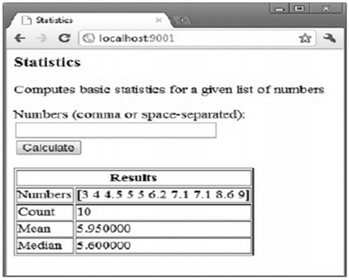

## 第十五章 网络、模版和网页应用

go 在编写 web 应用方面非常得力。因为目前它还没有 GUI（Graphic User Interface 即图形化用户界面）的框架，通过文本或者模板展现的 html 界面是目前 go 编写应用程序的唯一方式。

### 15.1 tcp 服务器

这部分我们将使用 TCP 协议和在 14 章讲到的协程范式编写一个简单的客户端 - 服务器应用：

+ 一个（web）服务器应用需要响应众多客户端的并发请求
+ go 会为每一个客户端产生一个协程用来处理请求

+ 我们需要使用 net 包中网络通信的功能。它包含了用于 TCP/IP 以及 UDP 协议、域名解析等方法.

服务器代码，单独的一个文件：

示例 15.1 [server.go](https://github.com/Unknwon/the-way-to-go_ZH_CN/blob/master/eBook/examples/chapter_15/server.go)

```go
package main

import (
	"fmt"
	"net"
)

func doServerStuff(conn net.Conn) {
	for {
		buf := make([]byte, 512)
		len, err := conn.Read(buf)
		if err != nil {
			fmt.Println("Error reading", err.Error())
			return // 终止程序
		}
		fmt.Printf("Receive data: %v", string(buf[:len]))
	}
}

func main() {
	fmt.Println("Starting the server ...")
	// 创建 listener
	listener, err := net.Listen("tcp", "localhost:50000")
	if err != nil {
		fmt.Println("Error listening", err.Error())
		return // 终止程序
	}

	// 监听并接受来自客户端的连接
	for {
		conn, err := listener.Accept()
		if err != nil {
			fmt.Println("Error accepting", err.Error())
			return // 终止程序
		}
		go doServerStuff(conn)
	}
}
```

我们在 main() 创建了一个 net.Listener 的变量，他是一个服务器的基本函数：用来监听和接收来自客户端的请求（来自 localhost 即 IP 地址为 127.0.0.1 端口为 50000 基于 TCP 协议）。

+ 用一个无限 for 循环的 `listener.Accept()` 来等待客户端的请求。客户端的请求将产生一个 `net.Conn` 类型的连接变量。
+ 一个独立的协程使用这个连接执行 `doServerStuff()`，开始使用一个 512 字节的缓冲 `data` 来读取客户端发送来的数据并且把它们打印到服务器的终端，`len` 获取客户端发送的数据字节数；
  + 当客户端发送的所有数据都被读取完成时，协程就结束了。
+ 这段程序会为每一个客户端连接创建一个独立的协程。必须先运行服务器代码，再运行客户端代码。

客户端代码写在另外一个文件 client.go 中：

示例 15.2 [client.go](https://github.com/Unknwon/the-way-to-go_ZH_CN/blob/master/eBook/examples/chapter_15/client.go)

```go
package main

import (
	"bufio"
	"fmt"
	"net"
	"os"
	"strings"
)

func main() {
	//打开连接:
	conn, err := net.Dial("tcp", "localhost:50000")
	if err != nil {
		//由于目标计算机积极拒绝而无法创建连接
		fmt.Println("Error dialing", err.Error())
		return // 终止程序
	}

	inputReader := bufio.NewReader(os.Stdin)
	fmt.Println("First, what is your name?")
	clientName, _ := inputReader.ReadString('\n')

	trimmedClient := strings.Trim(clientName, "\n")
	for {
		fmt.Println("What to send to the server? Type Q to quit.")
		input, _ := inputReader.ReadString('\n')
		trimmedInput := strings.Trim(input, "\n")
		if trimmedInput == "Q" {
			return
		}
		_, err = conn.Write([]byte(trimmedClient + " says: " + trimmedInput))
	}
}
```

客户端通过 `net.Dial` 创建了一个和服务器之间的连接

+ 它通过无限循环中的 os.Stdin 接收来自键盘的输入直到输入了 “Q”,接下来分割后的输入通过 connection 的 Write 方法被发送到服务器。
+ 当然，服务器必须先启动好，如果服务器并未开始监听，客户端是无法成功连接的。

如果在服务器没有开始监听的情况下运行客户端程序，客户端会停止并打印出以下错误信息：对tcp 127.0.0.1:50000发起连接时产生错误：由于目标计算机的积极拒绝而无法创建连接。

**客户端输入：**

```go
First, what is your name?
tjy
What to send to the server? Type Q to quit.
q
What to send to the server? Type Q to quit.
Q
```

**以下是服务器的输出：**

```go
Starting the server ...
Receive data: tjy says: qError reading EOF
```

**当客户端输入 Q 并结束程序时，服务器会输出以下信息：**

```go
Error reading EOF
```

**在网络编程中 net.Dial 函数是非常重要的，一旦你连接到远程系统，就会返回一个 Conn 类型接口，我们可以用它发送和接收数据。Dial 函数巧妙的抽象了网络结构及传输。所以 IPv4 或者 IPv6，TCP 或者 UDP 都可以使用这个公用接口。**

下边这个示例先使用 TCP 协议连接远程 80 端口，然后使用 UDP 协议连接，最后使用 TCP 协议连接 IPv6 类型的地址。

示例 15.3 [dial.go](https://github.com/Unknwon/the-way-to-go_ZH_CN/blob/master/eBook/examples/chapter_15/dial.go)

```go
func main() {
	conn, err := net.Dial("tcp", "192.0.32.10:80") // tcp ipv4
	checkConnection(conn, err)
	conn, err = net.Dial("udp", "192.0.32.10:80") // udp
	checkConnection(conn, err)
	conn, err = net.Dial("tcp", "[2620:0:2d0:200::10]:80") // tcp ipv6
	checkConnection(conn, err)
}

func checkConnection(conn net.Conn, err error) {
	if err != nil {
		fmt.Printf("error %v connecting!", err)
		os.Exit(1)
	}
	fmt.Printf("Connection is made with %v\n", conn)
}
```

下边也是一个使用 net 包从 socket 中打开，写入，读取数据的例子：

示例 15.4 [socket.go](https://github.com/Unknwon/the-way-to-go_ZH_CN/blob/master/eBook/examples/chapter_15/socket.go)

```go
package main

import (
	"fmt"
	"io"
	"net"
)

func main() {
	var (
		host          = "www.apache.org"
		port          = "80"
		remote        = host + ":" + port
		msg    string = "GET / \n"
		data          = make([]uint8, 4096)
		read          = true
		count         = 0
	)

	con, err := net.Dial("tcp", remote)
	// 发送我们的消息，一个http GET请求
	io.WriteString(con, msg)

	// 读取服务器的响应
	for read {
		count, err = con.Read(data)
		read = err == nil
		fmt.Printf(string(data[0:count]))
	}
	con.Close()
}
```


#### **练习 15.1 编写新版本的客户端和服务器 server1.go** 

编写新版本的客户端和服务器（[server1.go](https://github.com/Unknwon/the-way-to-go_ZH_CN/tree/master/eBook/exercises/chapter_15/server1.go)）：

1. 增加一个检查错误的函数 `checkError(error)`；

   + 讨论如下方案的利弊：为什么这个重构可能并没有那么理想？
   + 看看在[示例 15.14](https://github.com/Unknwon/the-way-to-go_ZH_CN/blob/master/eBook/examples/chapter_15/template_validation.go) 中它是如何被解决的

2. 使客户端可以通过发送一条命令 SH 来关闭服务器

3. 让服务器可以保存已经连接的客户端列表（他们的名字）；当客户端发送 WHO 指令的时候，服务器将显示如下列表：

   ```go
   This is the client list: 1:active, 0=inactive
   User IVO is 1
   User MARC is 1
   User CHRIS is 1
   ```

```go
package main

import (
	"fmt"
	"net"
	"os"
	"strings"
)

var mapUsers map[string]int

func checkError(error error) {
	if error != nil {
		panic("Error: " + error.Error()) // terminate program
	}
}

func DisplayList() {
	fmt.Println("--------------------------------------------")
	fmt.Println("This is the client list: 1=active, 0=inactive")
	for key, value := range mapUsers {
		fmt.Printf("User %s is %d\n", key, value)
	}
	fmt.Println("--------------------------------------------")
}

func doServerStuff(conn net.Conn) {
	var buf []byte
	var error error

	for {
		buf = make([]byte, 512)
		_, error = conn.Read(buf)
		checkError(error)

		input := string(buf)
		if strings.Contains(input, ": SH") {
			fmt.Println("Server shutting down")
			os.Exit(0)
		}

		// op commando WHO:  write out mapUsers
		if strings.Contains(input, ": WHO") {
			DisplayList()
		}
    
		// extract clientname:
		ix := strings.Index(input, "says")
		clName := input[0 : ix-1]
		mapUsers[string(clName)] = 1
		fmt.Printf("Received data: --%v--", string(buf))
	}
}

func main() {
	var listener net.Listener
	var err error
	var conn net.Conn
	mapUsers = make(map[string]int)
	
	fmt.Println("Starting the server ...")
	// 创建 listener
	listener, err = net.Listen("tcp", "localhost:50000")
	checkError(err)

	// 监听并接受来自客户端的连接
	for {
		conn, err = listener.Accept()
		if err != nil {
			fmt.Println("Error accepting", err.Error())
			return // 终止程序
		}
		go doServerStuff(conn)
	}
}

```


#### 对于练习 15.1 的优化和简化

下边这个版本的 simple_tcp_server.go 从很多方面优化了第一个 tcp 服务器的示例 server.go 并且拥有更好的结构，它只用了 80 行代码！

示例 15.5 [simple_tcp_server.go](https://github.com/Unknwon/the-way-to-go_ZH_CN/blob/master/eBook/examples/chapter_15/simple_tcp_server.go)：

```go
package main

import (
	"flag"
	"fmt"
	"net"
	"syscall"
)

const maxRead = 25

func handleMsg(length int, err error, msg []byte) {
	if length > 0 {
		print("<", length, ":")
		for i := 0; ; i++ {
			if msg[i] == 0 {
				break
			}
			fmt.Printf("%c", msg[i])
		}
		print(">")
	}
}

func sayHello(to net.Conn) {
	obuf := []byte{'L', 'e', 't', '\'', 's', ' ', 'G', 'O', '!', '\n'}
	wrote, err := to.Write(obuf)
	checkErrorInfo(err, "Write: wrote "+string(wrote)+" bytes.")
}

func checkErrorInfo(error error, info string) {
	if error != nil {
		panic("ERROR: " + info + " " + error.Error()) // terminate program
	}
}

func connectionHandler(conn net.Conn) {
	connFrom := conn.RemoteAddr().String()
	println("Connection from: ", connFrom)
	sayHello(conn)
	for {
		var ibuf []byte = make([]byte, maxRead+1)
		length, err := conn.Read(ibuf[0:maxRead])
		ibuf[maxRead] = 0 // to prevent overflow
		switch err {
		case nil:
			handleMsg(length, err, ibuf)
		case syscall.EAGAIN:
			continue
		default:
			goto DISCONNECT
		}
	}
DISCONNECT:
	err := conn.Close()
	println("Closed connection: ", connFrom)
	checkErrorInfo(err, "Close: ")
}

func initServer(hostAndPort string) net.Listener {
	serverAddr, err := net.ResolveTCPAddr("tcp", hostAndPort)
	checkErrorInfo(err, "Resolving address:port failed: '"+hostAndPort+"'")
	listener, err := net.ListenTCP("tcp", serverAddr)
	checkErrorInfo(err, "ListenTCP: ")
	println("Listening to: ", listener.Addr().String())
	return listener
}

func main() {
	flag.Parse()
	if flag.NArg() != 2 {
		panic("usage: host port")
	}
	hostAndPort := fmt.Sprintf("%s:%s", flag.Arg(0), flag.Arg(1))
	listener := initServer(hostAndPort)
	for {
		conn, err := listener.Accept()
		checkErrorInfo(err, "Accept: ")
		go connectionHandler(conn)
	}
}

```

- 服务器地址和端口不再是硬编码，而是通过命令行传入参数并通过 `flag` 包来读取这些参数。这里使用了 `flag.NArg()` 检查是否按照期望传入了 2 个参数：

- 在命令行中输入 simple_tcp_server localhost 50000 来启动服务器程序，然后在独立的命令行窗口启动一些 client.go 的客户端。当有两个客户端连接的情况下服务器的典型输出如下，这里我们可以看到每个客户端都有自己的地址：

  ```
  simple_tcp_server localhost 50000
  
  /*
  Listening to: 127.0.0.1:50000
  Connection from: 127.0.0.1:49346
  <25:Ivo says: Hi server, do y><12:ou hear me ?>
  Connection from: 127.0.0.1:49347
  <25:Marc says: Do you remembe><25:r our first meeting serve><2:r?>
  */
  ```


### 15.2 一个简单的网页服务器

Http 是一个比 tcp 更高级的协议，它描述了客户端浏览器如何与网页服务器进行通信。Go 有自己的 `net/http` 包，我们来看看它。

**我们从一些简单的示例开始，首先编写一个 “Hello world!”：**[查看示例 15.6 hello_world_webserver.go](https://github.com/Unknwon/the-way-to-go_ZH_CN/blob/master/eBook/examples/chapter_15/hello_world_webserver.go)

```go
package main

import (
	"fmt"
	"log"
	"net/http"
)

func HelloServer(w http.ResponseWriter, req *http.Request) {
	fmt.Println("Inside HelloServer handler")
	fmt.Fprintf(w, "Hello," + req.URL.Path[1:])
}

func main() {
	http.HandleFunc("/", HelloServer)
	err := http.ListenAndServe("localhost:8080", nil)
	if err != nil{
		log.Fatal("ListenAndServe", err.Error())
	}
}
```

我们引入了 `http` 包并启动了网页服务器，使用 `http.ListenAndServe("localhost:8080", nil)` 函数，如果成功会返回空，否则会返回一个错误。

+ `http.Request` 描述了客户端请求，内含一个 `URL` 属性
+ `http.URL` 描述了 web 服务器的地址，内含存放了 url 字符串的 `Path` 属性；

如果 req 请求是一个 POST 类型的 html 表单，“var1” 就是 html 表单中一个输入属性的名称，然后用户输入的值就可以通过 GO 代码：req.FormValue("var1") 获取到。

还有一种方法就是先执行 `request.ParseForm()` 然后再获取 `request.Form ["var1"] 的第一个返回参数，就像这样：

```go
var1, found := request.Form["var1"]
```

第二个参数 `found` 就是 `true`，如果 `var1` 并未出现在表单中，`found` 就是 `false`

网页服务器返回了一个 http.Response，它是通过 http.ResponseWriter 对象输出的，这个对象整合了 HTTP 服务器的返回结果；通过对它写入内容，我们就将数据发送给了 HTTP 客户端。

**现在我们还需要编写网页服务器必须执行的程序，它是如何处理请求的呢。这是在 `http.HandleFunc` 函数中完成的，就是在这个例子中当根路径 “/” 被请求的时候, `HelloServer` 函数就被执行了。**

+ `http.HandleFunc` 注册了一个处理函数 (这里是 `HelloServer`) 来处理对应 `/` 的请求。
+ `/` 可以被替换为其他特定的 url 比如 `/create`，`/edit` 等等；你可以为每一个特定的 url 定义一个单独的处理函数。
+ 处理函数需要两个参数：第一个是 `ReponseWriter` 类型的 `w`；第二个是请求 `req`。

使用命令行启动程序：

```go
go run hello_world_webserver.go 
```

然后打开你的浏览器并输入 url 地址：`http://localhost:8080/world`，浏览器就会出现文字：`Hello, world`，网页服务器会响应你在`:8080/` 后边输入的内容

**使用 `fmt.Println` 在控制台打印状态，在每个 handler 被请求的时候，在他们内部打印日志会很有帮助**

前两行（没有错误处理代码）可以替换成以下写法：

```go
http.ListenAndServe(":8080", http.HandlerFunc(HelloServer))
```

**http.Handle 的第二个参数也可以是 T 的一个 obj 对象：http.Handle("/", obj) 给 T 提供了 ServeHTTP 方法，实现了 http 的 Handler 接口：**

```go
func (obj *Typ) ServeHTTP(w http.ResponseWriter, req *http.Request) {
    ...
}
```

这个用法在 [章节 15.8](https://learnku.com/docs/the-way-to-go/152-a-simple-web-server/15.8.md) 类型 `Counter` 和 `Chan` 上使用过。只要实现了 `http.Handler`，`http` 包就可以处理任何 HTTP 请求。

**练习 15.2：[webhello2.go](https://github.com/Unknwon/the-way-to-go_ZH_CN/tree/master/eBook/exercises/chapter_15/webhello2.go)**

编写一个网页服务器监听端口 9999，有如下处理函数：

- 当请求 `http://localhost:9999/hello/Name` 时，响应：`hello Name`(Name 需是一个合法的姓，比如 Chris 或者 Madeleine)
- 当请求 `http://localhost:9999/shouthello/Name` 时，响应：`hello NAME`

```go
package main

import (
	"fmt"
	"log"
	"net/http"
	"strings"
)

func HelloServer1(w http.ResponseWriter, req *http.Request) {
	fmt.Println("Inside HelloServer handler - name")
	fmt.Fprintf(w, "Hello,"+req.URL.Path[len("/hello/"):])
}

func HelloServer2(w http.ResponseWriter, req *http.Request) {
	fmt.Println("Inside HelloServer handler - NAME")
	fmt.Fprintf(w, "Hello,"+strings.ToUpper(req.URL.Path[len("/shouthello/"):]))
}

func main() {
	http.HandleFunc("/hello/", HelloServer1)
	http.HandleFunc("/shouthello/", HelloServer2)
	err := http.ListenAndServe("localhost:8080", nil)
	if err != nil {
		log.Fatal("ListenAndServe", err.Error())
	}
}

```


**练习 15.3：[hello_server.go](https://github.com/Unknwon/the-way-to-go_ZH_CN/tree/master/eBook/exercises/chapter_15/hello_server.go)**

创建一个空结构 `hello` 并使它实现 `http.Handler`。运行并测试。

```go
package main

import (
	"fmt"
	"net/http"
)

type Hello struct{}

func (h Hello) ServeHTTP(w http.ResponseWriter, r *http.Request) {
	fmt.Fprint(w, "Hello!")
}

func main() {
	var h Hello
	http.ListenAndServe("localhost:4000", h)
}

```


### 15.3 访问并读取页面

在下边这个程序中，数组中的 url 都将被访问：

+ **会发送一个简单的 http.Head() 请求查看返回值**
+ 它的声明如下：func Head(url string) (r *Response, err error)

返回状态码会被打印出来。

示例 15.7 [poll_url.go](https://github.com/Unknwon/the-way-to-go_ZH_CN/blob/master/eBook/examples/chapter_15/poll_url.go)：

```go
package main

import (
	"fmt"
	"net/http"
)

var urls = []string{
	"http://www.google.com/",
	"http://golang.org/",
	"http://blog.golang.org/",
}

func main() {
	// Execute an HTTP HEAD request for all url's
	// and returns the HTTP status string or an error string.
	for _, url := range urls {
		resp, err := http.Head(url)
		if err != nil {
			fmt.Println("Error:", url, err)
		}
		fmt.Println(url, ": ", resp.Status)
	}
}

/*
http://www.google.com/ : 302 Found
http://golang.org/ : 200 OK
http://blog.golang.org/ : 200 OK
*/
```

在下边的程序中我们使用 `http.Get()` 获取网页内容；

+  `Get` 的返回值 `res` 中的 `Body` 属性包含了网页内容
+ 然后我们用 `ioutil.ReadAll` 把它读出来

示例 15.8 [http_fetch.go](https://github.com/Unknwon/the-way-to-go_ZH_CN/blob/master/eBook/examples/chapter_15/http_fetch.go)：

```go
package main

import (
    "fmt"
    "io/ioutil"
    "log"
    "net/http"
)

func main() {
    res, err := http.Get("http://www.google.com")
    checkError(err)
    data, err := ioutil.ReadAll(res.Body)
    checkError(err)
    fmt.Printf("Got: %q", string(data))
}

func checkError(err error) {
    if err != nil {
        log.Fatalf("Get : %v", err)
    }
}
```

当访问不存在的网站时，这里有一个 `CheckError` 输出错误的例子：

```go
2011/09/30 11:24:15 Get: Get http://www.google.bex: dial tcp www.google.bex:80:GetHostByName: No such host is known.
```

你可以把 google.com 更换为一个国内可以顺畅访问的网址进行测试

**在下边的程序中，我们获取一个 twitter 用户的状态，通过 `xml` 包将这个状态解析成为一个结构：**

示例 15.9 [twitter_status.go](https://github.com/Unknwon/the-way-to-go_ZH_CN/blob/master/eBook/examples/chapter_15/twitter_status.go)

```go
package main

import (
    "encoding/xml"
    "fmt"
    "net/http"
)

/*这个结构会保存解析后的返回数据。
他们会形成有层级的XML，可以忽略一些无用的数据*/
type Status struct {
    Text string
}

type User struct {
    XMLName xml.Name
    Status  Status
}

func main() {
    // 发起请求查询推特Goodland用户的状态
    response, _ := http.Get("http://twitter.com/users/Googland.xml")
    // 初始化XML返回值的结构
    user := User{xml.Name{"", "user"}, Status{""}}
    // 将XML解析为我们的结构
    xml.Unmarshal(response.Body, &user)
    fmt.Printf("status: %s", user.Status.Text)
}

/*
status: Robot cars invade California, on orders from Google: Google has been testing self-driving cars ... http://bit.ly/cbtpUN http://retwt.me/97p<exit code="0" msg="process exited normally"/>
*/
```

**我们会在 章节 15.4 中用到 http 包中的其他重要的函数：**

+ `http.Redirect(w ResponseWriter, r *Request, url string, code int)`：这个函数会让浏览器重定向到 url（是请求的 url 的相对路径）以及状态码。
+ `http.NotFound(w ResponseWriter, r *Request)`：这个函数将返回网页没有找到，HTTP 404 错误。
+ `http.Error(w ResponseWriter, error string, code int)`：这个函数返回特定的错误信息和 HTTP 代码。

+ 另 http.Request 对象的一个重要属性 req：req.Method，这是一个包含 GET 或 POST 字符串，用来描述网页是以何种方式被请求的。

go 为所有的 HTTP 状态码定义了常量，比如：

```go
http.StatusContinue     = 100
http.StatusOK           = 200
http.StatusFound        = 302
http.StatusBadRequest       = 400
http.StatusUnauthorized     = 401
http.StatusForbidden        = 403
http.StatusNotFound     = 404
http.StatusInternalServerError  = 500
```

你可以使用 `w.header ().Set ("Content-Type","../..") 设置头信息

比如在网页应用发送 html 字符串的时候，在输出之前执行 w.Header().Set("Content-Type", "text/html")。


**练习 15.4：扩展 http_fetch.go 使之可以从控制台读取 url，使用 章节 12.1 学到的接收控制台输入的方法 （http_fetch2.go）**

```go
// httpfetch.go
package main

import (
	"bufio"
	"fmt"
	"io/ioutil"
	"log"
	"net/http"
	"os"
	"strings"
)

func main() {
	fmt.Print("Give the url from which to read: ")
	iread := bufio.NewReader(os.Stdin)
	url, _ := iread.ReadString('\n')
	url = strings.Trim(url, " \n") // trimming space,etc.
  
	res, err := http.Get(url)
	CheckError(err)
	data, err := ioutil.ReadAll(res.Body)
	CheckError(err)
	fmt.Printf("Got: %q", string(data))
}

func CheckError(err error) {
	if err != nil {
		log.Fatalf("Get: %v", err)
	}
}
```

**练习 15.5：获取 json 格式的推特状态，就像示例 15.9（twitter_status_json.go）**

```go
// twitter_status_json.go
package main

import (
	"encoding/json"
	"fmt"
	"io/ioutil"
	"net/http"
)

type Status struct {
	Text string
}

type User struct {
	Status Status
}

func main() {
	/* perform an HTTP request for the twitter status of user: Googland */
	res, _ := http.Get("http://twitter.com/users/Googland.json")/*http://twitter.com/users/Googland.json页面不存在了*/
	/* initialize the structure of the JSON response */
	user := User{Status{""}}
	/* unmarshal the JSON into our structures */
	temp, _ := ioutil.ReadAll(res.Body)
	body := []byte(temp)
	json.Unmarshal(body, &user)
	fmt.Printf("status: %s", user.Status.Text)
}

/* Output:
status: Robot cars invade California, on orders from Google:
Google has been testing self-driving cars ... http://bit.ly/cbtpUN http://retwt.me/97p
*/
```


### 15.4 写一个简单的网页应用

下边的程序在端口 8088 上启动了一个网页服务器；`SimpleServer` 会处理 `/test1` url 使它在浏览器输出 `hello world`。

**FormServer 会处理 /test2 url：**

+ 如果 url 最初由浏览器请求，那么它就是一个 GET 请求，并且返回一个 form 常量，包含了简单的 input 表单，这个表单里有一个文本框和一个提交按钮。
+ **当在文本框输入一些东西并点击提交按钮的时候，会发起一个 POST 请求。**
+ FormServer 中的代码用到了 switch 来区分两种情况。
+ **在 POST 情况下，使用 request.FormValue("inp") 通过文本框的 name 属性 inp 来获取内容，并写回浏览器页面。**

在控制台启动程序并在浏览器中打开 url http://localhost:8088/test2 来测试这个程序：

示例 15.10 [simple_webserver.go](https://github.com/Unknwon/the-way-to-go_ZH_CN/blob/master/eBook/examples/chapter_15/simple_webserver.go)

```go
package main

import (
	"io"
	"net/http"
)

const form = `
    <html><body>
        <form action="#" method="post" name="bar">
            <input type="text" name="in" />
            <input type="submit" value="submit"/>
        </form>
    </body></html>
`

// SimpleServer /* handle a simple get request */
func SimpleServer(w http.ResponseWriter, request *http.Request) {
	io.WriteString(w, "<h1>hello, world</h1>")
}

func FormServer(w http.ResponseWriter, request *http.Request) {
	w.Header().Set("Content-Type", "text/html")
	switch request.Method {
	case "GET":
		/* display the form to the user */
		io.WriteString(w, form)
	case "POST":
		/* handle the form data, note that ParseForm must
		   be called before we can extract form data */
		//request.ParseForm();
		//io.WriteString(w, request.Form["in"][0])
		io.WriteString(w, request.FormValue("in"))
	}
}

func main() {
	http.HandleFunc("/test1", SimpleServer)
	http.HandleFunc("/test2", FormServer)
	if err := http.ListenAndServe(":8088", nil); err != nil {
		panic(err)
	}
}
```

**注：当使用字符串常量表示 html 文本的时候，包含 <html><body></body></html> 对于让浏览器识别它收到了一个 html 非常重要。**

+ 更安全的做法是在处理器中使用 w.Header().Set("Content-Type", "text/html") 在写入返回之前将 header 的 content-type 设置为 text/html
+ content-type 会让浏览器认为它可以使用函数 http.DetectContentType([]byte(form)) 来处理收到的数据


**练习 15.6 [statistics.go]**

**编写一个网页程序，可以让用户输入一连串的数字，然后将它们打印出来，计算出这些数字的均值和中值，就像下边这张截图一样：**



```go
package main

import (
	"fmt"
	"log"
	"net/http"
	"sort"
	"strconv"
	"strings"
)

type statics struct {
	numbers []float64
	mean    float64
	median  float64
}

const form = `<html><body><form action="/" method="POST">
<label for="numbers">Numbers (comma or space-separated):</label><br>
<input type="text" name="numbers" size="30"><br />
<input type="submit" value="Calculate">
</form></html></body>`

const error = `<p class="error">%s</p>`

var pageTop = ""
var pageBottom = ""

func homePage(writer http.ResponseWriter, request *http.Request) {
	writer.Header().Set("Content-Type", "text/html")
	err := request.ParseForm() // Must be called before writing response
	fmt.Fprint(writer, pageTop, form)
	if err != nil {
		fmt.Fprintf(writer, error, err)
	} else {
		if numbers, message, ok := processRequest(request); ok {
			stas := getStats(numbers)
			fmt.Fprint(writer, formatStats(stas))
		} else if message != "" {
			fmt.Fprintf(writer, error, message)
		}
	}
	fmt.Fprint(writer, pageBottom)
}

func processRequest(request *http.Request) ([]float64, string, bool) {
	var numbers []float64
	var text string
	if slice, found := request.Form["numbers"]; found && len(slice) > 0 {
		//处理如果网页中输入的是中文逗号
		if strings.Contains(slice[0], "&#65292") {
			text = strings.Replace(slice[0], "&#65292;", " ", -1)
		} else {
			text = strings.Replace(slice[0], ",", " ", -1)
		}

		for _, field := range strings.Fields(text) {
			if x, err := strconv.ParseFloat(field, 64); err != nil {
				return numbers, "'" + field + "' is invalid", false
			} else {
				numbers = append(numbers, x)
			}
		}
	}
	if len(numbers) == 0 {
		return numbers, "", false // no data first time form is shown
	}
	return numbers, "", true
}

func getStats(numbers []float64) (stats statics) {
	stats.numbers = numbers
	sort.Float64s(stats.numbers)
	stats.mean = sum(numbers) / float64(len(numbers))
	stats.median = median(numbers)
	return
}

func sum(numbers []float64) (total float64) {
	for _, x := range numbers {
		total += x
	}
	return
}

func median(numbers []float64) float64 {
	middle := len(numbers) / 2
	result := numbers[middle]
	if len(numbers)%2 == 0 {
		result = (result + numbers[middle-1]) / 2
	}
	return result
}

func formatStats(stats statics) string {
	return fmt.Sprintf(`<table border="1">
<tr><th colspan="2">Results</th></tr>
<tr><td>Numbers</td><td>%v</td></tr>
<tr><td>Count</td><td>%d</td></tr>
<tr><td>Mean</td><td>%f</td></tr>
<tr><td>Median</td><td>%f</td></tr>
</table>`, stats.numbers, len(stats.numbers), stats.mean, stats.median)
}

func main() {
	http.HandleFunc("/", homePage)
	if err := http.ListenAndServe(":9001", nil); err != nil {
		log.Fatal("failed to start server", err)
	}
}
```


### 15.5 让 Web 应用更加健壮

当 web 服务器发生一个恐慌（ panic ）时，我们的 web 服务器就会终止。这样非常的糟糕：一个 web 服务必须是一个健壮的程序，能够处理可能会出现的问题。

+ 一个方法是可以在每一个处理函数（ handler ）中去使用 defer/recover ，但是这样会导致出现很多重复的代码。

**更加优雅的解决方法是使用 13.5 章节 中的闭包的方法处理错误。我们将这种机制应用到上一节中的 simple webserver 中，当然，它也可以很容易的应用于任何 web 服务器的程序中。**

为了使代码更具可读性，我们为处理函数（HandleFunc）创建一个 type ：

```go
type HandleFnc func(http.ResponseWriter,*http.Request)
```

我们模仿 [13.5 章节](https://learnku.com/docs/the-way-to-go/135-a-pattern-that-handles-errors-with-closures/122) 的 errorHandler 函数，创建一个 logPanics 函数：

```go
func logPanics(function HandleFnc) HandleFnc {
    return func(writer http.ResponseWriter, request *http.Request) {
        defer func() {
            if x := recover(); x != nil {
                log.Printf("[%v] caught panic: %v", request.RemoteAddr, x)
            }
        }()
    		function(writer, request)
    }
}
```

然后我将处理函数作为回调包装进 logPanics：

```go
http.HandleFunc("/test1", logPanics(SimpleServer))
http.HandleFunc("/test2", logPanics(FormServer))
```

处理函数中应该包含一个 panic 的调用，或者像 [1.3 章节] 中的用来检查错误的 check (error) 函数；下面是完整的代码示例：

```go
package main

import (
	"log"
	"net/http"
)

type HandleFnc func(http.ResponseWriter, *http.Request)

// 将上一章节示例 15.10 中的代码复制过来，除了 main() 函数都复制过来

func main() {
	http.HandleFunc("/test1", logPanics(SimpleServer))
	http.HandleFunc("/test2", logPanics(FormServer))
	if err := http.ListenAndServe(":8088", nil); err != nil {
		panic(err)
	}
}

func logPanics(function HandleFnc) HandleFnc {
	return func(writer http.ResponseWriter, request *http.Request) {
		defer func() {
			if x := recover(); x != nil {
				log.Printf("[%v] caught panic: %v", request.RemoteAddr, x)
				// 默认出现 panic 只会记录日志，页面就是一个无任何输出的白页面，
				// 可以给页面一个错误信息，如下面的示例返回了一个 500
				http.Error(writer, http.StatusText(http.StatusInternalServerError), http.StatusInternalServerError)
			}
		}()
		function(writer, request)
	}
}
```


### 15.6 在 Web 应用中使用模版

**下面的程序是一个用来运行 wiki 的 web 应用，它用了不到 100 行代码实现了一组页面的显示、编辑、和保存。**

+ 可以通过 [wiki](https://golang.org/doc/articles/wiki/) 查看完整的代码，可以更好的理解程序是如何构建的。在这里我们将从上到下对整个程序进行补充说明。
+ 这个程序是一个 web 服务器，所以它必须在命令行启动

**功能：**

1. 浏览器可以通过像这样的 url 来访问 wiki 页面的内容： **[localhost:8080/view/page1](http://localhost:8080/view/page1)** 。
2. 然后会到和这个名字（page1）相同的文本文件中读取文件的内容展示在页面中；页面中包含了一个可以编辑 wiki 页面的超链接（ **[localhost:8080/edit/page1](http://localhost:8080/edit/page1)** ）。
3. 编辑页面用一个文本框显示内容，用户可以修改文本并通过 Save 按钮保存到文件中；然后会在相同的页面（view/page1）中查看到被修改的内容。
4. 如果想要查看的页面不存在（例如： **[localhost:8080/edit/page999](http://localhost:8080/edit/page999)** ），程序会将其跳转到一个编辑页面，这样就可以创建并保存一个新的 wiki 页面。

这个 wiki 页面需要一个标题和文本内容；它在程序中是由下面的结构体组成，内容是一个叫 Body 的字节切片。

```go
type Page struct {
    Title string
    Body []byte
}
```

为了在正在运行的程序之外保存我们的 wiki 页面，我们将使用简单的文本文件作为持久性存储。

```go
package main

import (
	"html/template"
	"io/ioutil"
	"log"
	"net/http"
	"regexp"
)

const lenPath = len("/view/")

var titleValidator = regexp.MustCompile("^[a-zA-Z0-9]+$")

var templates = make(map[string]*template.Template)

var err error

type Page struct {
	Title string
	Body  []byte
}

func init() {
	for _, teml := range []string{"edit", "view"} {
		templates[teml] = template.Must(template.ParseFiles(teml + ".html"))
	}
}

func makeHandler(fn func(http.ResponseWriter, *http.Request, string)) http.HandlerFunc {
	return func(w http.ResponseWriter, r *http.Request) {
		title := r.URL.Path[lenPath:]
		if !titleValidator.MatchString(title) {
			http.NotFound(w, r)
			return
		}
		fn(w, r, title)
	}
}

func load(title string) (*Page, error) {
	filename := title + ".txt"
	body, err := ioutil.ReadFile(filename)
	if err != nil {
		return nil, err
	}
	return &Page{Title: title, Body: body}, nil
}

func renderTemplate(w http.ResponseWriter, tmpl string, p *Page) {
	err := templates[tmpl].Execute(w, p)
	if err != nil {
		http.Error(w, err.Error(), http.StatusInternalServerError)
	}
}

func viewHandler(w http.ResponseWriter, r *http.Request, title string) {
	p, err := load(title)
	if err != nil {
		// 找不到页面
		http.Redirect(w, r, "/edit/"+title, http.StatusFound)
		return
	}
	renderTemplate(w, "view", p)
}

func editHandler(w http.ResponseWriter, r *http.Request, title string) {
	p, err := load(title)
	if err != nil {
		p = &Page{Title: title}
	}
	renderTemplate(w, "edit", p)
}

func (p *Page) save() error {
	filename := p.Title + ".txt"
	// 创建一个只有当前用户拥有读写权限的文件
	return ioutil.WriteFile(filename, p.Body, 0600)
}

func saveHandler(w http.ResponseWriter, r *http.Request, title string) {
	body := r.FormValue("body")
	p := &Page{Title: title, Body: []byte(body)}
	err := p.save()
	if err != nil {
		http.Error(w, err.Error(), http.StatusInternalServerError)
		return
	}

	http.Redirect(w, r, "/view/"+title, http.StatusFound)
}

func main() {
	http.HandleFunc("/view/", makeHandler(viewHandler))
	http.HandleFunc("/edit/", makeHandler(editHandler))
	http.HandleFunc("/save/", makeHandler(saveHandler))

	err := http.ListenAndServe(":8080", nil)
	if err != nil {
		log.Fatal("ListenAndServe: ", err.Error())
	}
}
```

**让我们来通读代码：**

1. template 可以动态创建我们的 html 文件

2. 我们必须有一个将我们的 Page 结构体中的数据插入到 web 页面中的标题和内容中的机制，是通过 template 包来完成的：

   + 首先在编辑器中创建一个 html 模板文件，例如 view.html ：从数据结构中插入的字段被放在 `{{ }}` 之间，这里的 `{{.Title |html}}` 和 `{{printf “%s” .Body |html}}` 中的数据都是来自 Page 结构体，`|html` 与 `printf "%s` 的用法看下面的章节。

     ```html
     <h1>{{.Title |html}}</h1>
     
     <p>[<a href="/edit/{{.Title |html}}">edit</a>]</p>
     
     <div>{{printf "%s" .Body |html}}</div>
     ```

   + `template.Must(template.ParseFiles(tmpl + ".html"))` 函数将模板文件转换成一个 *template.Template （Template 结构体的指针），为了提高效率，我们只在我们的程序中转换一次，放在 `init()` 函数中就可以很方便的实现了。这个模板对象被保存在内存中的一个以 html 文件名称为索引的 map 中。

   + 这种技术被称为 *模板缓存* ，并且是非常好的值得推荐的方法。

     ```go
     templates = make(map[string]*template.Template)
     ```

3. 为了让模板和结构体输出到页面，我们必须使用`templates[tmpl].Execute(w, p)` 函数。

   + 它会调用一个模板，将 `Page 结构体` p 作为一个参数在模板中进行替换，并且写入到 ResponseWriter w 中。
   + 这个函数必须去检查是否有错误输出；如果出现错误，我们调用 http.Error 来发送信号。
   + 这个代码将会在我们的程序中出现多次，所以我们把它分解成一个单独的函数 renderTemplate 。

4. 在我们的 web 服务器的 `main()` 中启动一个使用 8080 端口的 ListenAndServe；像 [15.2 章节](https://learnku.com/docs/the-way-to-go/152-a-simple-web-server/140) 一样，我们先定义一些处理函数，它们的访问地址是在 localhost:8080/ 后面加上 view、edit 或者 save 作为开始部分

   + 实际访问的时候还要加上充当持久化存储的文本文件的名称，如： localhost:8080/view/page999
   + 在大多数的 web 服务器程序中，这一系列的访问路径的处理函数的形式，就类似于 Ruby and Rails、Django 或者 ASP.NET MVC 这种 MVC 框架的路由表。
   + 请求的网址与这些路径的匹配，会先去与最长的路径去匹配；如果没有与任何路径匹配，就会和 / 匹配，/ 对应的处理函数将会被调用

**这里我们定义了 3 个处理函数，并且因为它们包含了重复的代码，我们拆分出了一个 makeHandler 函数。**

这是一个值得研究学习的相当特别的高阶函数；它用一个函数来作为它的第一个参数，并且将这个函数作为一个闭包返回：

```go
func makeHandler(fn func(http.ResponseWriter, *http.Request, string)) http.HandlerFunc {
	return func(w http.ResponseWriter, r *http.Request) {
		title := r.URL.Path[lenPath:]
		if !titleValidator.MatchString(title) {
			http.NotFound(w, r)
			return
		}
		fn(w, r, title)
	}
}
```

这个闭包为了构造它的返回值使用了一个闭合函数变量；但是在此之前，它使用了 `titleValidator.MatchString(title)` 来验证输入的标题。如果标题不是由字母与数字组成，会发出一个 NotFound 的错误信号。

```go
func load(title string) (*Page, error) {
	filename := title + ".txt"
	body, err := ioutil.ReadFile(filename)
	if err != nil {
		return nil, err
	}
	return &Page{Title: title, Body: body}, nil
}
```

viewhandler 尝试去读取一个指定标题的文本文件； 这是通过一个 load() 函数来完成的，它重新组合了文件名并通过 ioutil.ReadFile 去读取文件。如果文件被找到，会将它的内容读取到一个本地的字符串类型的 body 变量中。将数据填入指向 Page 结构体的指针中：&Page {Title: title, Body: body}

**并且将这个和一个为 nil 的错误一起返回给调用者。然后这个结构体通过 renderTemplate 来和模板合并。**

```go
func renderTemplate(w http.ResponseWriter, tmpl string, p *Page) {
	err := templates[tmpl].Execute(w, p)
	if err != nil {
		http.Error(w, err.Error(), http.StatusInternalServerError)
	}
}
```

如果出现错误，意味着磁盘中不存在 wiki 页面，将错误返回给 `viewHandler()` ， 它对自动的重定向到这个标题对应的编辑页面。

**通过点击编辑页面的保存按钮将页面的内容保存；这个按钮在以 <form action="/save/{{.Title}}" method="POST" > 开头的 html 表单中。**

+ 这意味着当从 localhost/save/{Title} （通过模板替换 Title）网址发送一个请求，会被发送到 web 服务器。对于这样的网址，我们定义了一个处理函数：saveHandler() 。
+ 通过 request 中的 FormValue() 方法，可以提取名字为 body 的文本域字段的内容，然后通过这个信息构造一个 Page 对象，并尝试通过 save() 函数保存。
+ 如果失败，会返回一个 http.Error 显示到浏览器中，如果它成功了，浏览器会重定向一个相同名称的展示页面。save() 函数非常简单： 使用 ioutil.WriteFile() 函数将 Page 结构体的 Body 字段写入一个叫 filename 的文件中。它使用 {{ printf “%s” .Body|html}} 。


### 15.7 探索 Template 扩展的功能

#### 15.7.1. 字段替代: {{.FieldName}}

在上一节中，我们使用了模板去合并结构体与 html 模板中的数据。

这对于构建 web 应用程序确实非常有用，但是模板技术比这更通用：数据驱动模板可以用于生成文本输出，HTML 仅仅是其中一个特例。

1. 通过执行 template 将模板与数据结构合并，在大多数情况下是一个结构体或者一个结构体的切片。
2. 它可以重写一段文本，通过传递给 templ.Execute () 的数据项进行替换生成新的内容。
3. 只有能被导出的数据项才可以用于模板合并。数据项可以是值或者指针。
   + 接口将传递的是值还是指针忽略了，因为实际使用中，无论是指针还是值都可以直接通过 `.Title` 来使用

 

如果 Name 是一个结构体中的字段，并且它的值需要在合并时替换，那么在模板中包含文本 {{.Name}} ；当 Name 是一个 map 的索引时，也可以这样使用。

Parse 方法通过解析一些模板定义的字符串来生成一个 template 作为内部表示，当参数是一个定义好的模板文件的路径时，使用 ParseFile。

+ 当解析出现问题的时候，第二个参数会返回 Error != nil 。
+ 在最后一步，数据结构通过 execute 方法与模板合并，并且将一个 io.Writer 写入到它的第一个参数

示例 15.13—template_field.go：

```go
package main

import (
	"fmt"
	"html/template"
	"os"
)

type Person struct {
	Name                string
	nonExportedAgeField string
}

func main() {
	t := template.New("hello")
	t, _ = t.Parse("hello {{.Name}}!")
	p := Person{Name:"Mary", nonExportedAgeField: "31"} // data
	
	if err := t.Execute(os.Stdout, p); err != nil {
		fmt.Println("There was an error:", err.Error())
	}
}

// Output: hello Mary!
```

我们的结构体包含了一个不能导出的字段，并且当我们尝试通过一个定义字符串去合并他时，像下面这样：

```go
t, _ = t.Parse("your age is {{.nonExportedAgeField}}!")
```

发生下面错误：There was an error: template：nonexported template hello:1: can’t evaluate field nonExportedAgeField in type main.Person.

**你可以直接在 `Execute()` 中使用 `{{.}}` 直接显示两个参数，结果就是： hello {Mary 31}!**

**当模板应用在浏览器中时，要先用 html 过滤器去过滤输出的内容，像这样： `{{html .}}` ，或者使用一个 FieldName `{{ .FieldName |html }}`**

+ `|html` 部分告诉 template 引擎在输出 FieldName 的值之前要通过 html 格式化它。
+ 他会转义特殊的 html 字符（ 如：会将 > 替换成 `&gt;` ）, 这样可以防止用户的数据破坏 HTML 表单。
+  `|html` 用起来就和 Linux 的 `|` （管道）类似，将前面命令的输出作为 `|` 后面命令的输入


#### 15.7.2. 模板验证

检查模板的语法是否定义正确，对 Parse 的结果执行 **Must** 函数。在下面的示例中 tOK 是正确， tErr 的验证会出现错误并会导致一个运行时恐慌（panic）！

示例 15.14—template_validation.go:

```go
package main

import (
    "text/template"
    "fmt"
)

func main() {
    tOk := template.New("ok")
    // 一个有效的模板，所以 Must 时候不会出现恐慌（panic）
    template.Must(tOk.Parse("/*这是一个注释 */ some static text: {{ .Name }}"))

    fmt.Println("The first one parsed OK.")
    fmt.Println("The next one ought to fail.")
    tErr := template.New("error_template")
    template.Must(tErr.Parse("some static text {{ .Name }"))
}

/*
The first one parsed OK.
The next one ought to fail.
panic: template: error_template:1: unexpected "}" in command
*/
```

模板语法中的错误应该不常见，因为会使用像 [13.3 章节](https://learnku.com/docs/the-way-to-go/133-recovery-from-panic-recover/120) 中的 defer/recover 机制去报告这个错误并纠正它。

下面的三个基本函数在代码中经常被链接使用，就像：

```go
var strTempl = template.Must(template.New(“TName”).Parse(strTemplateHTML))
```


**练习 15.7: template_validation_recover.go**

在上面的示例中，实现 defer/recover 机制。

```go
// template_validation_recover.go
package main

import (
	"fmt"
	"log"
	"text/template"
)

func main() {
	tOk := template.New("ok")
	tErr := template.New("error_template")
	defer func() {
		if err := recover(); err != nil {
			log.Printf("run time panic: %v", err)
		}
	}()

	//a valid template, so no panic with Must:
	template.Must(tOk.Parse("/* and a comment */ some static text: {{ .Name }}"))
	fmt.Println("The first one parsed OK.")
	fmt.Println("The next one ought to fail.")
	template.Must(tErr.Parse(" some static text {{ .Name }"))
}

/* Output:
The first one parsed OK.
The next one ought to fail.
2011/10/27 10:56:27 run time panic: template: error_template:1: unexpected "}" in command
*/
```


#### 15.7.3. If-else

**输出由 Execute 生成的模板结果中，包含了静态文本和在 {{}} 中包含的文本，它们被称为一个管道。**

例如： 运行这个代码 （示例程序 15.15 pipeline1.go ）：

```go
t := template.New("template test")

t = template.Must(t.Parse("This is just static text. \n{{\"This is pipeline data—because it is evaluated within the double braces.\"}} {{`So is this, but within reverse quotes.`}}\n"))

t.Execute(os.Stdout, nil)
```

获得这个输出结果:

```
This is just static text.

This is pipeline data—because it is evaluated within the double braces. So is this, but within reverse quotes.
```

现在我们可以使用 if-else-end 来调整管道数据的输出： 如果管道是空的，就像：

```go
in: {{if ``}} Will not print. {{end}}
```

if 条件的判断结果是 false ，并不会输出任何任内容，但是这个：

```go
{{if `anything`}} Print IF part. {{else}} Print ELSE part.{{end}}
```

Print IF part 将被输出。上面的内容在下面的程序中被说明：

**示例 15.16—template_ifelse.go:**

```go
package main

import (
	"html/template"
	"os"
)

func main() {
	tEmpty := template.New("template test")
	// if 是一个空管道时的内容
	tEmpty = template.Must(tEmpty.
		Parse("Empty pipeline if demo: {{if ``}} Will not print. {{end}}\n"))
	tEmpty.Execute(os.Stdout, nil)

	tWithValue := template.New("template test")
	// 如果条件满足，则为非空管道
	tWithValue = template.Must(tWithValue.
		Parse("Non empty pipeline if demo: {{if `anything`}} Will print. {{end}}\n"))
	tWithValue.Execute(os.Stdout, nil)

	tIfElse := template.New("template test")
	// 如果条件满足，则为非空管道
	tIfElse = template.Must(tIfElse.
		Parse("if-else demo: {{if `anything`}} Print IF part. {{else}} Print ELSE part.{{end}}\n"))
	tIfElse.Execute(os.Stdout, nil)
}


/*

Empty pipeline if demo:

Non empty pipeline if demo: Will print.

if-else demo: Print IF part.
*/
```


#### 15.7.4. 点与 with-end

**在 Go 模板中的值 `{{.}}` 被设置为当前管道的值。**

**with 语句将点的值设置为管道的值。**

+ **如果管道是空的，就会跳过 with 到 end 之前的任何内容；**
+ **当嵌套使用时，点会从最近的范围取值。**

示例 15.17—template_with_end.go:

```go
package main

import (
    "os"
    "text/template"
)

func main() {
    t := template.New("test")
    
  	t, _ = t.Parse("{{with `hello`}}{{.}}{{end}}!\n")
    t.Execute(os.Stdout, nil)
    
  	t, _ = t.Parse("{{with `hello`}}{{.}} {{with `Mary`}}{{.}}{{end}} {{end}}!\n")
    t.Execute(os.Stdout, nil)
}

/*
hello!
hello Mary!
*/
```


#### 15.7.5. 模板变量 $

你可以在变量名前加一个「$」符号来为模板中的管道创建一个局部变量。

变量名称只能由字母、数字、下划线组成。在下面的示例中，我使用了几种可以使用的变量名称。

示例 15.18—template_variables.go:

```go
package main

import (

	"os"

	"text/template"

)

func main() {
	t := template.New("test")
	t = template.Must(t.Parse("{{with $3 := `hello`}}{{$3}}{{end}}!\n"))
	t.Execute(os.Stdout, nil)

	t = template.Must(t.Parse("{{with $x3 := `hola`}}{{$x3}}{{end}}!\n"))
	t.Execute(os.Stdout, nil)

	t = template.Must(t.Parse("{{with $x_1 := `hey`}}{{$x_1}} {{.}} {{$x_1}} {{end}}!\n"))
	t.Execute(os.Stdout, nil)
}

/*
hello!

hola!

hey hey hey!*/
*/
```


#### 15.7.6. Range-end

这个构造的格式：

```go
{{range pipeline}} T1 {{else}} T0 {{end}}
```

range 在循环的集合中使用： 

+ 管道的值必须是一个数组、切片或者 map 。
+ 如果管道的值的长度为零，点不会被影响并且 T0 会被执行；
+ 否则将点设置成拥有连续元素的数组、切片或者 map， T1 就会被执行。

```go
如果它是模板:         {{range .}} 
                        {{.}} 
                        {{end}}

然后是这个代码:           s := []int{1,2,3,4}
                         t.Execute(os.Stdout, s)

将会输出:               
                        1
                        2
                        3
                        4   
```

可以查看 20.7 章节，它是一个更有用的示例，其中来自 App Engine 数据存储的数据通过一个模板展示：

```go
{{range .}}

    {{with .Author}}

        <p><b>{{html .}}</b> wrote:</p>

    {{else}}

        <p>An anonymous person wrote:</p>

    {{end}}

    <pre>{{html .Content}}</pre>

    <pre>{{html .Date}}</pre>

{{end}}
```

range . 这里循环了一个结构体的切片，每个结构体都包含了一个 Author、Content 和 Date 字段。


#### 15.7.7. 预定义模板函

还可以在你的代码中使用一些预定义的模板函数，例如： 和 fmt.Printf 函数类似的 printf 函数：

示例 15.19—predefined_functions.go：

```go
package main

import (
	"os"
	"text/template"
)

func main() {
	t := template.New("test")
	t = template.Must(t.Parse("{{with $x := `hello`}}{{printf `%s %s` $x `Mary`}} {{end}}!\n"))
	t.Execute(os.Stdout, nil)
}

/*
hello Mary!
*/
```

在 15.6 章节 中也这样使用过：

```go
{{ printf "%s" .Body|html}}
```

否则 Body 的字节会被当做数字显示（字节默认都是 int8 类型的数字）


### 15.8 一个多功能的精致的 WebServer

为了进一步加深你对 http 包的理解以及如何去构建一个 web 服务器的功能，学习并尝试练习下面代码：

示例 15.20—elaborated_webserver.go:

```go
package main

import (
	"bytes"
	"expvar"
	"flag"
	"fmt"
	"io"
	"log"
	"net/http"
	"os"
	"strconv"
)

var helloRequest = expvar.NewInt("hello-request")

var webroot = flag.String("root", "/home/user", "web root directory")

var booleanflag = flag.Bool("boolean", true, "another flag for testing")

// Counter 简单的服务器计数器，发布它将设置值
type Counter struct {
	n int
}

// Chan 一个通道
type Chan chan int

func Logger(w http.ResponseWriter, req *http.Request) {
	log.Print(req.URL.String())
	w.WriteHeader(404)
	w.Write([]byte("oops"))
}

func HelloServer2(w http.ResponseWriter, req *http.Request) {
	helloRequest.Add(1)
	io.WriteString(w, "hello, world!\n")
}

// 通过这个方法满足 expvar.Var 接口，所以就可以直接导出它。
func (ctr *Counter) String() string {
	return fmt.Sprintf("%d", ctr.n)
}

func (ctr *Counter) ServeHTTP(w http.ResponseWriter, req *http.Request) {
	switch req.Method {
	case "GET": // 给 n + 1
		ctr.n++
	case "POST": // 设置 n 去发不值
		buf := new(bytes.Buffer)
		io.Copy(buf, req.Body)
		body := buf.String()
		if n, err := strconv.Atoi(body); err != nil {
			fmt.Fprintf(w, "bad POST: %v \n body: [%v]\n", err, body)
		} else {
			ctr.n = n
			fmt.Fprint(w, "counter reset\n")
		}
	}
	fmt.Fprintf(w, "counter = %d\n", ctr.n)
}

func FlagServer(w http.ResponseWriter, req *http.Request) {
	w.Header().Set("Content-Type", "text/plain; charset=utf-8")
	fmt.Fprint(w, "Flags:\n")
	flag.VisitAll(func(f *flag.Flag) {
		if f.Value.String() != f.DefValue {
			fmt.Fprintf(w, "%s = %s [default = %s]\n", f.Name, f.Value.String(), f.DefValue)
		} else {
			fmt.Fprintf(w, "%s = %s\n", f.Name, f.Value.String())
		}
	})
}

// ArgServer 简单参数服务器
func ArgServer(w http.ResponseWriter, req *http.Request) {
	for _, s := range os.Args {
		fmt.Fprint(w, s, " ")
	}
}

func ChanCreate() Chan {
	c := make(Chan)
	go func(c Chan) {
		for x := 0; ; x++ {
			c <- x
		}
	}(c)
	return c
}

func (ch Chan) serveHTTP(w http.ResponseWriter, req *http.Request) {
	io.WriteString(w, fmt.Sprintf("channel send #%d\n", <-ch))
}

// DateServer 执行一个程序，输出重定向
func DateServer(rw http.ResponseWriter, req *http.Request) {
	rw.Header().Set("Content-Type", "text/plain; charset=utf-8")
	r, w, err := os.Pipe()
	if err != nil {
		fmt.Fprintf(rw, "pipe: %s\n", err)
		return
	}

	p, err := os.StartProcess("/bin/date", []string{"date"}, &os.ProcAttr{Files: []*os.File{nil, w, w}})
	defer r.Close()
	w.Close()

	if err != nil {
		fmt.Fprintf(rw, "fork/exec: %s\n", err)
		return
	}
	defer p.Release()
	io.Copy(rw, r)
	wait, err := p.Wait()
	if err != nil {
		fmt.Fprintf(rw, "wait: %s\n", err)
		return
	}
	if !wait.Exited() {
		fmt.Fprintf(rw, "date: %v\n", wait)
		return
	}
}

func main() {
	flag.Parse()
	http.Handle("/", http.HandlerFunc(Logger))
	http.Handle("/go/hello", http.HandlerFunc(HelloServer))
	// 计数器直接作为一个变量被发布
	ctr := new(Counter)
	expvar.Publish("counter", ctr)
	http.Handle("/counter", ctr)
	http.Handle("/go/", http.StripPrefix("/go/", http.FileServer(http.Dir(*webroot))))
	http.Handle("/flags", http.HandlerFunc(FlagServer))
	http.Handle("/args", http.HandlerFunc(ArgServer))
	//http.Handle("/chan", http.HandlerFunc(ChanCreate()))
	http.Handle("/date", http.HandlerFunc(DateServer))

	err := http.ListenAndServe(":12345", nil)
	if err != nil {
		log.Panicln("ListenAndServe:", err)
	}
}

```

处理浏览器中的网址： [localhost:12345/](http://localhost:12345/) ，并根据 / 后面接的路径进行处理：

```
Logger: http://localhost:12345/   浏览器输出： oops 
```

Logger 会用 w.WriteHeader (404) 记录一个 404 Not Found header。

这个技术通常很有用，当 web 处理代码发生错误的时候，它可以想这样应用：

```go
if err != nil {
    w.WriteHeader(400)
    return 
}
```

它也可以通过 logger 函数和每一次请求的 url 在 web 服务器的命令窗口上记录日期 + 时间

> 简单的把上面内容整理一下，就是当 url 中的地址不存在（没有对应的路由）时，就会去匹配 / 对应的处理函数（ Logger()），它会在页面中显示一个 oops ，并且在 header 中写入 404（可以通过浏览器调试模式的 console 或者 network 查看，直接是看不到 404 的），在命令行窗口（也可以理解成日志文件）中记录下错误信息，就像这样的结果： 2018/05/27 21:08:42 /，这个里面包含了访问的地址和发生的时间。

```
HelloServer: http://localhost:12345/go/hello    浏览器输出：hello, world!
```

> HelloServer 使用到了 expvar 包，它可以创建一个变量（可能是 int、float 或者 string 类型），并且通过发布去公开他们。使用 JSON 格式在 HTTP /debug/vars （译者注：就是可以通过 localhost:12345/debug/vars 查看这些被公开的变量） 公开这些变量。它一般用于服务器中的操作计数器； helloRequests 是一个 int64 类型的变量，访问 localhost:12345/go/hello ，将向这个变量的值加 1， 然后像浏览器中输出 「 hello, world! 」

```go
Counter: http://localhost:12345/counter counter = 1 
GET 方式刷新结果是： counter = 2
```

> Counter 对象 ctr 有一个 String () 方法，所以它就实现了 Var 接口（译者注：因为 Var 接口只有一个 String 方法）。 虽然它是一个结果体，但是这样就可以将它发布（译者注： publish 的第二个参数是个 Var 接口，所以想要发布的结构体必须实现这个接口）。
>
> ServeHTTP 是 ctr 的 Handler 方法，因为它有一个正确的签名（译者注：ctr 实现了 ServeHTTP 方法，就实现了 Handler 接口，可以看到示例中，就不需要再通过 HandlerFunc 了，因为它自己就已经是一个 Handler 了）。

```
FileServer: http://localhost:12345/go/ggg.html    浏览器输出：404 page not found
```

FileServer 返回一个 root 参数的值为根目录的文件来处理 HTTP 请求。通过 http.Dir 去使用操作系统的文件系统，如：

```go
http.Handle("/go/", http.FileServer(http.Dir("/tmp")))
```

译者注： 可以在 /tmp 目录下创建一个 ggg.html , 再访问 /go/ggg.html 的时候就会直接在浏览器中显示 ggg.html 的内容。

```
FlagServer: http://localhost:12345/flags

结果：
Flags:
boolean = true
root = /home/user
```

这个 handler 通过 flag.VisitAll 函数去遍历所有的 flags （前面的两个命令行参数），打印他们的变量名、值、默认值（如果值不是默认值的时候）。

```
ArgServer: http://localhost:12345/args    输出结果： ./elaborated_webserver.exe
```

这个 handler 遍历 os.Args 去打印所有的命令行参数；如果没有就只会打印程序的名称（可执行文件的目录）。

```
Channel: http://localhost:12345/chan 

结果：
channel send #1
刷新后: channel send #2
```

通道的 ServeHTTP 方法在每个新请求中显示来自通道的下一个整数。所以一个 Web 服务器可以从一个通道接收响应，由另一个函数填充（甚至是客户端）。下面代码片段显示了一个可以完成这个工作的 handler 函数，但是它会在 30 秒后超时：

```go
func ChanResponse(w http.ResponseWriter, req *http.Request) {
    timeout := make (chan bool)

    go func () {
        time.Sleep(30e9)
       timeout <- true
    }()

    select {
        case msg := <-messages:
          io.WriteString(w, msg)
        case stop := <-timeout:
        return
    }
}
```

```
DateServer: http://localhost:12345/date 

输出结果：显示当前的时间 (只能用于类 Unix，因为它调用了 /bin/date)
```

可能会输出: Thu Sep 8 12:41:09 CEST 2011

`os.Pipe()` 返回一对连接的文件；从 `r` 读取，并且返回的字节写入 `w`。

它返回文件和一个错误（如果有的话）： `func Pipe() (r *File, w *File, err error)` 。


### 15.9 RPC 远程调用

Go 程序可以通过 net/rpc 包相互通讯，所以这是另一个客户端 - 服务器端模式的应用。

+ 这个包使用了 http 协议、tcp 协议和用于数据传输的 gob 包。
+ **服务器注册一个对象，通过对象的类型名称暴露这个服务：**
  + 注册后就可以通过网络或者其他远程客户端的 I/O 连接它的导出方法。
+ 服务器可以注册多个不同类型的对象（服务），但是相同的类型注册多个对象的时候会出错。

这里我们讨论一个简单的示例： 我们定义一个 `Args` 类型，并且在它上面创建一个 `Multiply` 方法，最好封装在一个单独的包中；这个方法必须返回一个可能的错误。

示例 15.21—rpc_objects.go:

```go
package rpc_objects

type Args struct {
	N, M int
}

func (t *Args) Multiply(args *Args, reply *int) error {
	*reply = args.N * args.M
	return nil
}
```

服务器创建一个用于计算的对象:

+ **并且将它通过 `rpc.Register(object)` 注册**
+ **调用 `HandleHTTP()` ，并在一个地址上使用 `net.Listen` 开始监听。**

+ 你也可以通过名称注册对象，如：`rpc.RegisterName("Calculator", calc)`

> 译者注： rpc.Register 要求 Multiply 方法的返回值要求是一个 error 类型，所以示例的 net.Error 执行会出错，因此要换成 error 类型（有可能是版本更新造成的，测试使用的 Go 版本为： go1.10.1 ）。
>

对每一个进入到 `listener` 的请求，都是由协程去启动一个`http.Serve(listener, nil)` ，为每一个传入的 HTTP 连接创建一个新的服务线程。

+ 我们必须保证在一个特定的时间内服务器是唤醒状态，如：`time.Sleep(1000e9)` （1000 秒）

示例 15.22—rpc_server.go:

```go
package main

import (
	"examples/chapter_15/rpc_objects"
	"log"
	"net"
	"net/http"
	"net/rpc"
	"time"
)

func main() {
	cal := new(rpc_objects.Args)
	rpc.Register(cal)
	rpc.HandleHTTP()

	listener, e := net.Listen("tcp", "localhost:1234")
	if e != nil {
		log.Fatal("Starting RPC-server -listen error:", e)
	}

	go http.Serve(listener, nil)
	time.Sleep(1000e9)
}

/* 输出:
** after 5 s: **  
End Process exit status 0
*/
```

客户端必须知道服务器端定义的对象的类型和它的方法。

+ `rpc.DialHTTP()` 去创建连接的客户端，当客户端被创建时，它可以通过 `client.Call("Type. Method", args, &reply)` 去调用远程的方法，
  + 其中 `Type` 与 `Method` 是调用的远程服务器端被定义的类型和方法
  + `args` 是一个类型的初始化对象
  + `reply` 是一个变量，使用前必须要先声明它，它用来存储调用方法的返回结果

示例 15.23—rpc_client.go:

```go
package main

import (
	"examples/chapter_15/rpc_objects"
	"fmt"
	"log"
	"net/rpc"
)

const serverAddress = "localhost"

func main() {
	client, err := rpc.DialHTTP("tcp", serverAddress+":1234")
	if err != nil {
		log.Fatal("Error dialing", err)
	}

	// Synchronous call
	args := &rpc_objects.Args{7, 8}
	var reply int
	err = client.Call("Args.Multiply", args, &reply)
	if err != nil {
		log.Fatal("Args error:", err)
	}
	
	fmt.Printf("Args: %d * %d = %d", args.N, args.M, reply)
}

/*
Args: 7 * 8 = 56
*/
```

这个调用是同步的，所以需要等待结果返回。如果想要异步调用可以这样：

```go
call1 := client.Go("Args.Multiply", args, &reply, nil)

replyCall := <- call1.Done
```

如果最后一个参数的值为 `nil`，在调用完成后将分配一个新的通道。

如果你有一台用 `root` 运行的 Go 服务器，并且想以不同的用户去运行你的代码，Brad Fitz 的 `go-runas` 包使用 `rpc` 包可以实现：[github.com/bradfitz/go-runas](https://github.com/bradfitz/go-runas) 。

在第 [19 章节 ](https://learnku.com/docs/the-way-to-go/191-introduction/203)我们将看到在一个完整的项目中的 `rpc` 应用程序。


### 15.10 使用 netchan 夸网络实现消息传递

备注： Go 团队决定改进和修改现在版本的 netchan 包。这个包已经被移动到 old/netchan ，并且 old/ 层级的包中是保留的不被推荐的代码，它已经从 Go 1. 中从标准库中移除。**本章节为了向后兼容，只讨论下 netchan 包的概念。**

一个与 `rpc` 密切相关的在网络上使用 通道 的技术。

1. 之前讲过的通道作为一个本地通道被使用，它们只存在于执行它们的机器的内存空间中。
2. `netchan` 包实现了类型安全的网络通道： 它允许通道的两端出现在通过网络连接的不同计算机上。
   + 一个出口按照名称发布 一个（组）通道。
   + 一个入口去连接出口的机器，并按照名称输入到通道 。
   + 网络 通道不是同步的，它们就像是缓冲通道。

在发送机器上，代码就像这样：

```go
exp, err := netchan.NewExporter("tcp", "netchanserver.mydomain.com:1234")
if err != nil {
   log.Fatalf("Error making Exporter: %v", err)
}
ch := make(chan myType)
err := exp.Export("sendmyType", ch, netchan.Send)
if err != nil {
   log.Fatalf("Send Error: %v", err)
}
```

接收方代码:

```go
imp, err := netchan.NewImporter("tcp", "netchanserver.mydomain.com:1234")
if err != nil {
   log.Fatalf("Error making Importer: %v", err)
}
ch := make(chan myType)
err = imp.Import("sendmyType", ch, netchan.Receive)
if err != nil {
   log.Fatalf("Receive Error: %v", err)
}
```

 了解下原理就可以了，这个包已经被 Go 团队废弃


### 15.11 Websocket 通讯

备注： Go 团队决定在 Go 1 版本中将 `websocket` 包从标准库移到 `code.google.com/p/go` 的 `websocket` 子库中。预计在不久的将来也会发生巨大的改变。

导入 `websocket` 包将变成这样:

```go
import websocket “code.google.com/p/go/websocket”
```

`websocket` 协议与 `http` 协议相比，它是**基于客户端与服务器端会话的持久链接**，除此之外，功能几乎和 `http` 相同。

+ 在示例 15.24 中，是一个典型的 `websocket` 服务，启动它，然后监听一个来自 `websocket` 客户端的输入。
+ 示例 15.25 是一个客户端代码，它会在 5 秒后终止。
+ 当一个客户端与服务器端连接后，服务器端后打印： new connection；当客户端停止的时候，服务器端会打印： EOF => closing connection 。

> 译者注： 现在这个包已经被放在了 `golang.org/x/net/websocket` 中，要想使用它需要在命令行执行： `go get golang.org/x/net/websocket` 。

代码 15.24—websocket_server.go:

```go
package main

import (
	"fmt"
	"golang.org/x/net/websocket"
	"net/http"
)

func server(ws *websocket.Conn) {
	fmt.Printf("new connection\n")
	buf := make([]byte, 100)
	for {
		if _, err := ws.Read(buf); err != nil {
			fmt.Printf("%s", err.Error())
			break
		}
	}
	fmt.Printf("=> close connection\n")
	ws.Close()
}

func main() {
	http.Handle("/websocket", websocket.Handler(server))
	err := http.ListenAndServe(":12345", nil)
	if err != nil {
		panic("ListenAndServe: " + err.Error())
	}
}
```

代码 15.25—websocket_client.go:

```go
package main

import (
	"fmt"
	"golang.org/x/net/websocket"
	"time"
)

func readFromServer(ws *websocket.Conn) {
	buf := make([]byte, 1000)
	for {
		if _, err := ws.Read(buf); err != nil {
			fmt.Printf("%s\n", err.Error())
			break
		}
	}
}

func main() {
	ws, err := websocket.Dial("ws://localhost:12345/websocket", "",
		"http://localhost/")
	if err != nil {
		panic("Dial: " + err.Error())
	}
	go readFromServer(ws)
	time.Sleep(5e9)
	ws.Close()
}
```


### 15.12 SMTP 发送邮件

smtp 包实现了一个简单的邮件传输协议来发送邮件。它包含了一个代表客户端连接到 SMTP 服务器的 Client 类型：

+ Dial 返回一个用于连接到 SMTP 服务器的客户端
+ 设置 Mail（= 寄件人） 和 Rcpt （= 收件人）
+ Data 返回一个可以写入数据的 `writer`，这里用 `buf.WriteTo(wc)` 写入

示例 15.26—smtp.go:

```go
package main

import (
	"bytes"
	"log"
	"net/smtp"
)

func main() {
	// 连接到远程 SMTP 服务器。
	client, err := smtp.Dial("mail.example.com:25")
	if err != nil {
		log.Fatal(err)
	}

	// 设置寄件人和收件人
	client.Mail("sender@example.org")
	client.Rcpt("recipient@example.net")

	// 发送邮件主体。
	wc, err := client.Data()
	if err != nil {
		log.Fatal(err)
	}
	defer wc.Close()

	buf := bytes.NewBufferString("This is the email body.")
	if _, err = buf.WriteTo(wc); err != nil {
		log.Fatal(err)
	}
}
```

如果需要权限认证并且有多个收件人，可以使用 `SendMail` 函数。。它可以使用下面示例的格式来发送一封邮件:

1. `addr` 是需要连接服务器
2. 如果可以切换到 `TLS (安全传输层协议)` ，通过机制 `a` 进行认证
3. `from` 是寄件人地址 、`to` 是发件人地址 、 `msg` 是发送的消息：

```go
func SendMail(addr string, a Auth, from string, to []string, msg []byte) error
```

示例 15.27—smtp_auth.go:

```go
package main

import (
	"log"
	"net/smtp"
)

func main() {
	// 设置认证信息。
	auth := smtp.PlainAuth(
		"",
		"user@example.com",
		"password",
		"mail.example.com",
	)

	// 连接到服务器, 认证, 设置发件人、收件人、发送的内容,
	// 然后发送邮件。
	err := smtp.SendMail(
		"mail.example.com:25",
		auth,
		"sender@example.org",
		[]string{"recipient@example.net"},
		[]byte("This is the email body."),
	)
	if err != nil {
		log.Fatal(err)
	}
}
```

> 译者注：
> 按照这个示例代码，发送邮件是会被拒信的。看了下 SendMail 的源码，它要求 msg 参数要符合 `RFC 822` 电子邮件的标准格式。
> 所以示例中的 `"This is the email body."` 要修改一下才能发送成功。修改后的示例如下：
> "To: recipient@example.net\r\nFrom: sender@example.org\r\nSubject: 邮件主题\r\nContent-Type: text/plain; charset=UTF-8\r\n\r\nHello World"
> 当然，也要把里面的寄件人、收件人等信息按照实际去修改一下。