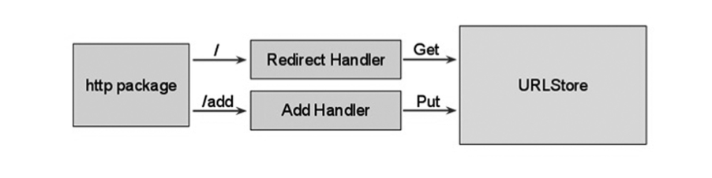
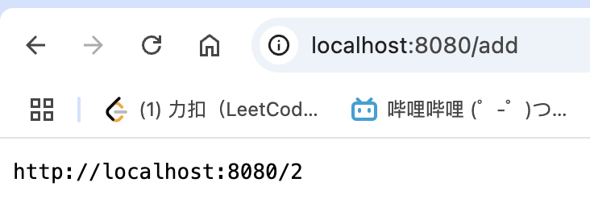
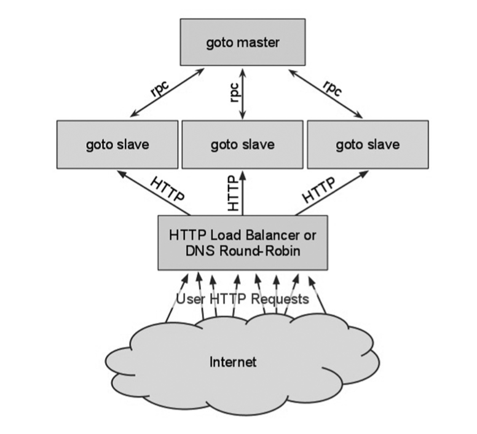

## 第十九章 构建完整的应用程序

### 19.1 简介

在这个章节，我们将开发一个完整的程序： `goto` ， 一个短 URL web 应用，因为 web 无处不在。

这个示例来自 Andrew Gerrand 的精彩演讲（ 参见文献： 22）。我们将分三个阶段完成，每一个阶段会有更多的功能，并逐渐展现 Go 语言的更多特性。我们将大量使用我们在 15 章 中的 web 应用中学习到的知识。

- 版本 1 ： 使用一个 `map` 和 `struct` ，以及来自 `sync` 包与一个结构工厂的 `Mutex` 。
- 版本 2 ： 持久化数据，因为将它写入到了一个 `gob` 格式的文件。
- 版本 3 ： 使用协程和通道重写应用。
- 版本 4 ： 如果我们想要一个 `json` 版本，该怎么改变？
- 版本 5： 一个使用 `rpc` 协议的分布式版本。

因为代码会频繁改变，所以不在这里打印，但是可以到网站下载。


### 19.2. UrlShortener 项目介绍

你一定知道浏览器中的一些地址（被称为 URLs）非常的长并且复杂，网络上会有一些服务将他们变成一个非常友好的短 URL，来代替他们使用。我们的项目就像这个：它是一个具有两个功能的 web 服务：

+ **添加：** 给它一个长的 URL，会返回一个短的版本，例如：
  + [maps.google.com/maps?f=q&source...](https://maps.google.com/maps?f=q&source=s_q&hl=en&geocode=&q=tokyo&sll=37.0625,-95.6)（A） 变成： [goto/UrcGq](http://goto/UrcGq)（B） 并且存储这一对数据
+ **重定向：** 当请求短 URL 的时候，它将用户重定向到原始的、长的 RUL： 所以当你在浏览器中输入类型 B ，它将你重定向到 A 的页面。

**版本 1 — 数据结构与 web 服务器的前面部分：**

第一个版本的代码 *goto_v1* （在章节 19.3 与 章节 19.4 中讨论），能在这里找到：[goto_v1](https://github.com/unknwon/the-way-to-go_ZH_CN/tree/master/eBook/examples/chapter_19/goto_v1)


### 19.3. 数据结构分析

[这个章节的代码，可以在 goto_v1\store.go 中找到]

当我们的应用在生产环境中运行的时候，它将接收到很多短网址的请求，并且还会收到很多将一个长网址变短的请求。我们的程序会用哪些数据结构存储这些数据？

+ 如在 章节 19.2 中的 url 类型 （A）和（B）都是一个字符串，并且它们彼此相关
+ 我们可以将（B）作为键，通过它去获取（A）的值，它们相互映射。
+ 为了将数据存储在内存中，我们需要这样一种结构，几乎所有编程语言都存在的，用不同的名字作下标的 `hash` 表、字典等。

Go 有一个这样的内置的 `map` ：一个 `map[string]string`

在 Go 中，我们使用关键字 `type` 可以做到，所以我们定义一个： `type URLStore map[string]string`

1. 要创建一个该类型命名的变量 `m`，只需使用： m := make(URLStore)
2. 假设我们想要存储 [goto/a](http://goto/a) 到 [google.com/](http://google.com/) 的映射到 `m` , 我们可以使用这样的语句： `m["a"] = "http://google.com/"`
3. 要检索指定的 `a` 对应的长网址，我们写： `url := m["a"]`

**使它线程安全：**

1. 添加操作可能被另一个相同类型的请求打断，并且长网址的值可能不会被写入。也可能会将读取的内容一起修改，导致读取到一个错误的结果。
2.  一个 `map` 不是线程安全的，它将会并发处理许多的请求，所以我们必须使我们的 `URLStore` 类型安全的从一个单独的线程去访问。
3. 最简单和经典的方法就是为它添加一个锁。在 `Go` 中，这是一个标准库中 `sync` 包中的 `Mutex` 类型，我们必须将它导入到我们的代码中。

我们将我们的 **URLStore** 的类型更改成一个 `struct` ，它有两个字段： `map` 和 一个 `sync` 包中的 `RWMutex` ：

```go
import “sync”

type URLStore struct {

    urls map[string]string    // map 是从短网址到长网址

    mu    sync.RWMutex

}
```

一个 `RWMutex` 有两个锁： 一个用于读取，一个用于写入。多个客户端可以同时获得读取锁，但是只能有一个客户端能够获得写入锁（禁用所有读取器），从而有效的序列化更新，使他们连续的工作。

我们将在一个 `Get` 方法中实现重定向我们读类型的请求，并且我们添加一个 `Set` 方法来处理写的请求。Get 方法看起来就像这样：

```go
func (s *URLStore) Get(key string) string {

    s.mu.RLock()

    url := s.urls[key]

    s.mu.RUnlock()

    return url

}
```

它传入一个 `key` （短网址），并将相应的 `map` 中的值作为 url 返回。

`Set` 方法需要同时传入一个 `key` 和 一个 `url` ，并且必须使用一个写锁 `Lock()` 来阻止在同一时间的任何其他的更新。它返回一个布尔类型的 `true` 或者 `false` 值来表示 `Set` 是否成功。

```go
func (s *URLStore) Set(key, url string) bool {

    s.mu.Lock()

    _, present := s.urls[key]

    if present {

        s.mu.Unlock()

        return false

    }

    s.urls[key] = url

    s.mu.Unlock()

    return true

}
```

通过 `_, present := s.urls[key]` 这种形式，我们可以测试看看我们的 `map` 是否已经包含了这个 `key`，存在 `present` 变成 `true`，否则为 `false`。

**使用 `defer` 来简化代码：**

在这种情况下，因为代码简单，它可以很容易的记住去执行 `Unlock` 。然而，在非常复杂的代码中，就可能会被忘记了或者放在错误的地方，导致的问题难以追踪。对于这种情况，`Go` 有一个特殊的关键字 `defer` ，在这种情况下，它允许在执行完锁定后立即发出解锁信号，但其效果是 `Unlock()` 只会在函数返回之前才会被执行。

Get 可以被简化为 （我们已经去除了局部变量 `url`）：

```go
func (s *URLStore) Get(key string) string {

    s.mu.RLock()

    defer s.mu.RUnlock()

    return s.urls[key]

}
```

Set 的逻辑也变得非常的清晰（我们不需要再考虑解锁）：

```go
func (s *URLStore) Set(key, url string) bool {

    s.mu.Lock()

    defer s.mu.Unlock()

    _, present := s.urls[key]

    if present {

        return false

    }

    s.urls[key] = url

    return true

}
```

**URLStore 工厂函数：**

URLStore 结构体包含一个 map 字段，在使用它之前，必须要使用 make 初始化。在 Go 中通过定义个 New 前缀的函数来完成创建一个结构体的实例，该函数返回一个被初始化的类型的实例（在这里，大多数情况下，它是一个指向它的指针）:

```go
func NewURLStore() *URLStore {

    return &URLStore{ urls: make(map[string]string) }

}
```

**使用我们的 URLStore：**

向我们的 map 添加一对新的 短 / 长 URL ，我们需要做的是调用 `s` 上的 `Set` 方法，并且由于这是一个布尔值，我们能立即包装它到一个 if 语句中：

```go
if s.Set("a", "http://google.com") {

    // success

}
```

要取回指定短网址 `a` 的长网址，我们将调用 `s` 上的 Get 方法，并将结果放到一个 `url` 变量中：

```go
if url := s.Get(“a”); url != “” {

    // redirect to url

} else {

    // key not found

}
```

在 Go 中，我们可以使用它的一个特性， `if` 可以在条件之前，使用一个初始化语句。我们还需要一个 `Count()` 方法，来为我们计算 map 中的键值对的数量，这是由一个内置的 `len` 函数实现的。

```go
func (s *URLStore) Count() int {

    s.mu.RLock()

    defer s.mu.RUnlock()

    return len(s.urls)

}
```

我们如何计算指定的长网址的短网址？我们使用一个函数 `genKey(n int) string {…}` 并且它的整形参数我们赋予它 `s.Count()` 当前的值。

我们现在可以做一个 **Put** 方法，它需要一个长网址，使用 `genKey` 生成他的短网址 `key` ，使用 Set 方法，将长网址使用这个（短网址） key 作为下标储存，并返回它的 key：

```go
func (s *URLStore) Put(url string) string {

    for {

        key := genKey(s.Count())

        if s.Set(key, url) {

            return key

        }

    }

    // 不应该到这里

    return ""

}
```

for 循环一直重试 Set ， 直到它成功（表示我们生成了一个尚未存在的短网址）。到现在为止，我们已经定义了我们的数据存储和处理它的函数（可以在 store.go 中找到代码）。

但是这本身并没有做任何事，我们还必须去定义一个 web 服务器去提供添加与重定向服务。

**store.go  完整代码如下：**

```go
package main

import "sync"

type URLStore struct {
	urls map[string]string
	mu   sync.RWMutex
}

func NewURLStore() *URLStore {
	return &URLStore{urls: make(map[string]string)}
}

func (u *URLStore) Get(key string) string {
	u.mu.RLock()
	defer u.mu.RUnlock()
	return u.urls[key]
}

func (u *URLStore) Set(key, url string) bool {
	u.mu.Lock()
	defer u.mu.Unlock()
	if _, present := u.urls[key]; present {
		return false
	}
	u.urls[key] = url
	return true
}

func (u *URLStore) Count() int {
	u.mu.RLock()
	defer u.mu.RUnlock()
	return len(u.urls)
}

func (u *URLStore) Put(url string) string {
	for {
		key := genKey(u.Count()) // generate the short URL
		if ok := u.Set(key, url); ok {
			return key
		}
	}
	// shouldn't get here
	return ""
}
```

其中 key.go 代码如下：

```go
package main

var keyChar = []byte("0123456789abcdefghijklmnopqrstuvwxyzABCDEFGHIJKLMNOPQRSTUVWXYZ")

func genKey(n int) string {
	if n == 0 {
		return string(keyChar[0])
	}
	l := len(keyChar)
	s := make([]byte, 20) // FIXME: will overflow. eventually.
	i := len(s)
	for n > 0 && i >= 0 {
		i--
		j := n % l
		n = (n - j) / l
		s[i] = keyChar[j]
	}
	return string(s[i:])
}
```


### 19.4. 用户界面：Web 网页前端

[本章节的代码可以在 goto_v1\main.go 中找到]

我们还没有编写我们程序启动所必须的功能。我们可以使用下面命令在 8080 端口上启动一个本地的 web 服务器：

```go
http.ListenAndServe(":8080", nil)
```

web 服务器在一个无限循环中监听传入的请求，但是我们还必须去定义该服务器如何去响应这些请求。

我们通过使用 HandleFunc 函数来创建所谓的 HTTP 处理程序来完成此操作，示例代码：

```go
http.HandleFunc("/add", Add)
```

我们的程序将有两个 HTTP 处理器：

- Redirect， 重定向短网址的请求，以及
- Add，处理新提交的 URLs 

示例图：



```go
func main() {
    http.HandleFunc("/", Redirect)
    http.HandleFunc("/add", Add)

    http.ListenAndServe(":8080", nil)
}
```

我们的 Add 函数必须做什么？

i）读取长 URL，即： 通过 `r.FormValue("url")` ，从一个 HTTP 请求包含的 html 表单读取。

ii） 在 `store` （译者注： NewURLStore () 返回的变量） 上使用我们的 `Put` 方法将它保存。

iii） 发送相应的短 URL 给用户

每个需求在代码行中的翻译：

```go
func Add(w http.ResponseWriter, r *http.Request) {

    url := r.FormValue("url")

    key := store.Put(url)

    fmt.Fprintf(w, "http://localhost:8080/%s", key)
}
```

fmt 包的 Fprintf 函数用来在包含 % s 的字符串中替换 `key`，然后将这个字符串作为响应发送回客户端。

> 请注意： Fprintf 写入一个 ResponseWriter，其实 Fprintf 能写入任何实现了 io.Writer() 的数据结构体，这意味着它实现了一个 Write () 方法。io.Writer () 是 Go 中的一个接口，并且我们看到，通过接口的使用，Fprintf 是非常的通用，它能写入很多不同的东西。在 Go 中，接口的使用是无处不在的，它使代码变得更加通用。

**但是我们仍然需要一个表单，我们可以再次使用 Fprintf 显示一个表单，这次给 `w` 写入一个常量。当没有提供 url 的时候，我们修改 Add 去显示一个 HTML 表单：**

```go
func Add(w http.ResponseWriter, r *http.Request) {
    url := r.FormValue("url")

    if url == "" {
        fmt.Fprint(w, AddForm)
        return
    }

    key := store.Put(url)
    fmt.Fprintf(w, "http://localhost:8080/%s", key)
}

const AddForm = `
<form method="POST" action="/add">
URL: <input type="text" name="url">
<input type="submit" value="Add">
</form>
`
```

在这种情况下，我们发送一个常量字符串 AddForm 给客户端，这实际上是创建了一个需要包含一个 form 表单的 html，form 中有一个 url 的 input 字段、一个提交按钮，**当推送时将发送一个 `/add` 结尾的请求。**

**所以 Add 处理器函数再次被调用，现在从文本字段获取了一个值。**

Redirect 函数在 HTTP 请求路径中找到 `key`（短 URL 的 key 是请求路径去除第一个字符，在 Go 中可以这样去写 `[1:]` ; 如 请求 `/abc` ， key 将是 `abc` ），通过 `store` 的 Get 函数取出相应的长 URL ，然后向用户发送一个 HTTP 重定向。如果 URL 没有找到，发送一个 `404 "Not Found"` 错误：

```go

func Redirect(w http.ResponseWriter, r *http.Request) {

    key := r.URL.Path[1:]

    url := store.Get(key)

    if url == "" {

        http.NotFound(w, r)

        return

    }

    http.Redirect(w, r, url, http.StatusFound)

}
```

（http.NotFound 和 http.Redirect 是发送常见 HTTP 响应的助手函数）

现在我们已经完成了 `goto_v1` 所有代码。

**main.go 的源码如下：**

```go

```

测试程序：打开一个浏览器并请求下面的 URL：[localhost:8080/add](http://localhost:8080/add)

在这开始我们的添加处理函数。 表单中还没有任何 url 变量，所以响应的是 html 格式的请求输入：


添加一个你想要变短的长网址，例如：[golang.org/pkg/bufio/#Writer](https://golang.org/pkg/bufio/#Writer) ，并且按下 Add 按钮。应用程序为你制作了一个 短 URL 并打印出来，例如： [localhost:8080/2](http://localhost:8080/2)



复制并粘贴这个 URL 到你的浏览器的地址栏中，然后访问它。它会执行一个重定向，并显示长 URL 的页面。


**版本 2 --- 添加持久化存储**

第 2 版的代码在 *goto_v2* 中，可以在[goto_v2](https://github.com/unknwon/the-way-to-go_ZH_CN/tree/master/eBook/examples/chapter_19/goto_v2)中找到。

[本节的代码能在 goto_v2 目录中的 store.go 和 main.go 中找到]

当 goto 进程（运行在 8080 端口的 web 服务器）结束时，这个迟早并一定会发生， map 保存在内存中的 URLs 将会丢失。

+ 要保存我们 map 中的数据，我需要将它保存到一个磁盘文件中。我们将修改 URLStore ，用于将它的数据写入到一个文件，并且在 goto 启动的时候恢复这个数据。
+ 为了实现它，我们将使用 Go 的 encoding/gob 包：这是一个序列化与反序列化包，它将数据结构转换成 bytes 数组（或者更准确的说是一个切片），反之依然。

使用 gob 包的 `NewEncoder` 与 `NewDecoder` 函数，你来决定向它写入数据或者从它读取数据。

+ 由 Encoder 与 Decoder 所产生的对象提供了 Encode 和 Decode 的方法，用于向文件中写入和读取 Go 数据结构。
+  Encoder 实现了 Writer 接口，Decoder 也同样可以实现了 Reader 接口

**我们将向 URLStore 添加一个新的 `file` 字段（ `*os.File` 类型 ）， 它将是一个可以用于写入和读取的打开文件的句柄 。**

```go
type URLStore struct {
    urls map[string]string
    mu sync.RWMutex
    file *os.File
}
```

当我们实例化 URLStore 的时候，我们将调用这个文件 `store.gob` ，并将它的名称作为参数： `var store = NewURLStore("store.gob")`

现在我们必须调整我们的 NewURLStore 函数：

```go
func NewURLStore(filename string) *URLStore {
    s := &URLStore{urls: make(map[string]string)}
    // open and set a file
  	f, err := os.OpenFile(filename, os.O_RDWR|os.O_CREATE|os.O_APPEND, 0644)
    if err != nil {
        log.Fatal("URLStore:", err)
    }
    s.file = f
    return s
}
```

NewURLStore 函数现在得到一个 filename 参数，打开文件，并且在我们的 URLStore 的变量 store 的 file 字段中保存 *os.File 的值，这里被称为 s 。

**调用 OpenFile 可能会失败（例如，我们的磁盘文件可能被删除或重命名）, 它能返回一个错误 err，注意 Go 是如何处理的：**

```go
f, err := os.OpenFile(filename, os.O_RDWR|os.O_CREATE|os.O_APPEND, 0644)
if err != nil {
    log.Fatal("URLStore:", err)
}
```

我们用可写的方式打开文件，更确切的说是在追加模式下。每次在我们的程序中创建一对新的 （短、长） URL ，我们将通过 gob 将它保存在 `store.gob` 文件中。

为此，我们定义一个新的结构体类型 record ：

```go
type record struct {
    Key, URL string
}
```

以及一个新的 save 方法，它将给定的 key 和 url 作为一个 gob 编码的 record 写入到磁盘。

```go

func (s *URLStore) save(key, url string) error {
    e := gob.NewEncoder(s.file)
    return e.Encode(record{key, url})
}
```

在 goto 启动的时候，我们磁盘上的数据存储必须读取到 URLStore 中，为此，我们有一个 load 方法

```go
func (s *URLStore) load() error {
    if _, err := s.file.Seek(0, 0); err != nil {
        return err
    }

    d := gob.NewDecoder(s.file)
    var err error
    for err == nil {
        var r record
        if err = d.Decode(&r); err == nil {
            s.Set(r.Key, r.URL)
        }
    }

    if err == io.EOF {
        return nil
    }
    return err
}
```

新的 load 方法将从文件的开头寻找、读取并解码每一条记录，然后使用 Set 方法保存数据到 map 中。再次注意无处不在的错误处理。这个文件的解码是一个无限循环，只要没有错误就会一直继续下去.

+ 如果我们收到一个错误，它可能是因为我们刚好解码到最后一条记录，然后遇到一个 io.EOF (文件结束) 错误；
+ 如果不是这种情况，则是我们在解码时发生错误，要将 err 返回。

这个方法必须添加到 NewURLStore ：

```go

func NewURLStore(filename string) *URLStore {
    s := &URLStore{urls: make(map[string]string)}
    f, err := os.OpenFile(filename, os.O_RDWR|os.O_CREATE|os.O_APPEND, 0644)
    if err != nil {
        log.Fatal("Error opening URLStore:", err)
    }
    s.file = f

    if err := s.load(); err != nil {
        log.Println("Error loading data in URLStore:", err)
    }
    return s
}
```

同样的，在 Put 函数中，当我们向我们的 map 添加一对新的 url 时，它也应该立即被保存到数据文件：

```go
func (s *URLStore) Put(url string) string {
    for {
        key := genKey(s.Count())
        if s.Set(key, url) {
            if err := s.save(key, url); err != nil {
                    log.Println("Error saving to URLStore:", err)
              }
            return key
        }
    }
    panic("shouldn't get here")
}
```

**完整的 goto_v2 中的 store.go 如下：**

```go
package main

import (
	"encoding/gob"
	"io"
	"log"
	"os"
	"sync"
)

type URLStore struct {
	urls map[string]string
	mu   sync.RWMutex
	file *os.File
}

type record struct {
	Key, Url string
}

func NewURLStore(filename string) *URLStore {
	s := &URLStore{urls: make(map[string]string)}
	f, err := os.OpenFile(filename, os.O_RDWR|os.O_CREATE|os.O_APPEND, 0644)
	if err != nil {
		log.Fatal("Error opening URLStore:", err)
	}
	s.file = f
	if err = s.load(); err != nil {
		log.Fatal("Error loading URLStore:", err)
	}
	return s
}

func (u *URLStore) Get(key string) string {
	u.mu.RLock()
	defer u.mu.RUnlock()
	return u.urls[key]
}

func (u *URLStore) Set(key, url string) bool {
	u.mu.Lock()
	defer u.mu.Unlock()
	if _, present := u.urls[key]; present {
		return false
	}
	u.urls[key] = url
	return true
}

func (u *URLStore) Count() int {
	u.mu.RLock()
	defer u.mu.RUnlock()
	return len(u.urls)
}

func (u *URLStore) Put(url string) string {
	for {
		key := genKey(u.Count()) // generate the short URL
		if ok := u.Set(key, url); ok {
			if err := u.save(key, url); err != nil {
				log.Println("fail to save url into urlstore:", err)
			}
			return key
		}
	}
	panic("shouldn't get here")
}

func (u *URLStore) load() error {
	if _, err := u.file.Seek(0, 0); err != nil {
		return err
	}
	d := gob.NewDecoder(u.file)
	var err error
	if err == nil {
		var r record
		if err = d.Decode(&r); err == nil {
			u.Set(r.Key, r.Url)
		}
	}

	if err == io.EOF {
		return nil
	}
	return err
}

func (u *URLStore) save(key, url string) error{
	e := gob.NewEncoder(u.file)
	return e.Encode(record{key, url})
}
```

> 第一次启动 goto 的时候，文件 store.gob 还不存在，所以在加载的时候你会收到一个错误： 2011/09/11 11:08:11 Error loading URLStore: open store.gob: The system cannot find the file specified.
>
> 停止进程并重新启动，然后它开始运行。或者你可以在启动 goto 之前，简单的创建一个空的 store. gob 文件。
>

备注： 当第 2 次启动 goto 的时候，你可能会收到这个错误：

```go
Error loading URLStore: extra data in buffer
```

这是因为 gob 是一个基于流的协议，不支持重启。 在第 4 版中，我们将使用 json 作为存储协议，来弥补这种情况。


### 19.6. 使用 Goroutines 来提高性能

**版本 3--- 添加协程**

第 3 版 *goto_v3* 的代码能在[goto_v3](https://github.com/unknwon/the-way-to-go_ZH_CN/tree/master/eBook/examples/chapter_19/goto_v3) 目录中找到。

如果有太多的客户端试图同时添加 URLs ，第 2 版仍然存在一个性能问题： 由于锁定机制，我们的 map 可以安全的更新并发访问，**但是立即将每一个新记录写入到磁盘，是一个瓶颈。**

**核心：写入磁盘的过程涉及到磁盘读写，是一个比较耗时的问题**

+ 磁盘写入可能会同时发生，并且根据你的操作系统的特性，可能会导致崩溃。
+ 即使写入不会冲突，每个客户端在 Put 函数返回之前，必须等待他们的数据写入到磁盘。
+ 因此，在 I/O 负载大的系统上，客户端需要等待的时间将超过完成添加请求所必须的时间。

为了解决这个问题，我们必须将 Put 与 Save 的过程解耦合：可以通过 Go 的并发机制做到这点。**我们不再将记录直接保存到磁盘，而是发送它们到一个通道，这是一种缓冲，所以发送函数不需要再等待它。**

+ **写入磁盘的保存过程从这个通道读取，并且是启动在一个叫 saveloop 的协程单独启动的线程上。**
+ **主程序与 saveloop 是同时执行的，所以没有那么多的阻塞。**

我们通过一个 record 类型的通道替换 URLStore 中的 file 字段： `save chan record` 。

```go
type URLStore struct {
    urls map[string]string
    mu sync.RWMutex
    save chan record
}
```

一个 channel，就像一个 map 一样必须使用 make 创建；我们将修改我们的工厂 NewURLStore ，在它里面使用 make 去创建 channel ，并给他一个 1000 长度的缓冲区，如：  `save := make(chan record, saveQueueLength)` 。

为了弥补我们的性能瓶颈， Put 可以将一个 record 发送到我们的 channel 缓冲区保存，而不是进行函数调用保存每一条记录到磁盘。

```go
func (s *URLStore) Put(url string) string {
    for {
        key := genKey(s.Count())
        if s.Set(key, url) {
            s.save <- record{key, url}
            return key
        }
    }
    panic("shouldn't get here")
}
```

在 save channel 的另一端，我们必须有一个接收器： 我们的新方法 saveLoop 将运行在一个单独的 goroutine 中； 它接收 record 的值并将他们写入到一个文件。 

saveLoop 也是在 NewURLStore () 函数中通过 go 关键字启动，我们现在可以删除不再需要的文件打开的代码。

**这里修改后的 NewURLStore () ：**

```go
const saveQueueLength = 1000
func NewURLStore(filename string) *URLStore {
    s := &URLStore{
        urls: make(map[string]string),
        save: make(chan record, saveQueueLength),
    }

    if err := s.load(filename); err != nil {
        log.Println("Error loading URLStore:", err)
    }

    go s.saveLoop(filename)
    return s
}
```

**这里是 saveLoop 方法的代码：**

```go
func (s *URLStore) saveLoop(filename string) {
    f, err := os.Open(filename, os.O_WRONLY|os.O_CREATE|os.O_APPEND, 0644)
    if err != nil {
        log.Fatal("URLStore:", err)
    }

    defer f.Close()
    e := gob.NewEncoder(f)
    for {
        // taking a record from the channel and encoding it
        r := <-s.save
        if err := e.Encode(r); err != nil {
            log.Println("URLStore:", err)
        }
    }
}
```

Records 从一个无限循环中的 `save channel` 读取并编码到文件。

还要注意，现在我们仅创建了一次 Encoder 对象， 而不是每次保存，这样也节省了一些内存和处理。

**另外一个改善可以使 goto 变得更加灵活：**

+ 替换代码中的 filename 
+ 硬编码的或者作为程序中常量的监听地址和主机名
+ 我们可以将它们定义为 flags 

这样，当启动程序的时候，如果在命令行中输入这些值，它们将被替换成新的值，如果没有输入，将从 flag 中获取默认值。这个功能来自一个不同的包，所以我们必须： import "flag"

我们首先创建一些全局变量去保存 flag 的值：

```go
var (
    listenAddr = flag.String("http", ":8080", "http listen address")
    dataFile = flag.String("file", "store.gob", "data store file name")
    hostname = flag.String("host", "localhost:8080", "host name and port")
)
```

为了处理命令行参数，我们必须添加 `flag.Parse()` 到 main 函数中，并且在 flags 被解析后实例化 URLStore ，因为参数解析后我们才能知道 `dataFile` 的值

**在代码中使用的是 `*dataFile` ，这时因为 flag 是一个指针，必须取消引用去获取值:**

```go
var store *URLStore
func main() {
    flag.Parse()
    store = NewURLStore(*dataFile)
    http.HandleFunc("/", Redirect)
    http.HandleFunc("/add", Add)
    http.ListenAndServe(*listenAddr, nil)
}
```

在 Add 处理器中，我们现在必须将 `localhost:8080` 替换成 `*hostname` ：

```go
fmt.Fprintf(w, "http://%s/%s", *hostname, key)
```

**修改后的完整 goto_v3 中的 store.go 代码如下：**

```go
package main

import (
	"encoding/gob"
	"io"
	"log"
	"os"
	"sync"
)

const saveQueueLength = 1000

type URLStore struct {
	urls map[string]string
	mu   sync.RWMutex
	save chan record
}

type record struct {
	Key, Url string
}

func NewURLStore(filename string) *URLStore {
	s := &URLStore{
		urls: make(map[string]string),
		save: make(chan record, saveQueueLength),
	}
	if err := s.load(filename); err != nil {
		log.Fatal("Error loading URLStore:", err)
	}
	go s.saveLoop(filename)
	return s
}

func (u *URLStore) Get(key string) string {
	u.mu.RLock()
	defer u.mu.RUnlock()
	return u.urls[key]
}

func (u *URLStore) Set(key, url string) bool {
	u.mu.Lock()
	defer u.mu.Unlock()
	if _, present := u.urls[key]; present {
		return false
	}
	u.urls[key] = url
	return true
}

func (u *URLStore) Count() int {
	u.mu.RLock()
	defer u.mu.RUnlock()
	return len(u.urls)
}

func (u *URLStore) Put(url string) string {
	for {
		key := genKey(u.Count()) // generate the short URL
		if ok := u.Set(key, url); ok {
			u.save <- record{key, url}
			return key
		}
	}
	panic("shouldn't get here")
}

func (u *URLStore) load(filename string) error {
	var err error
	var f *os.File
  // open the file read-write.
	f, err = os.OpenFile(filename, os.O_RDWR|os.O_CREATE|os.O_APPEND, 0644)
	if err != nil {
		log.Println("Error opening URLStore:", err)
		return err
	}
	defer f.Close()

  // file.Seek(0, 0) 的作用是将文件指针重新定位到文件的开头位置。
	if _, err := f.Seek(0, 0); err != nil {
		return err
	}
	d := gob.NewDecoder(f)
	for err == nil {
		var r record
		if err = d.Decode(&r); err == nil {
			u.Set(r.Key, r.Url)
		}
	}
	if err == io.EOF {
		return nil
	}
	log.Println("Error decoding URLStore:", err) // map hasn't been read correctly
	return err
}

func (u *URLStore) saveLoop(filename string) error {
	f, err := os.OpenFile(filename, os.O_WRONLY|os.O_CREATE|os.O_APPEND, 0644)
	if err != nil {
		log.Fatal("Error opening URLStore: ", err)
	}
	defer f.Close()
	e := gob.NewEncoder(f)
	for {
		r := <-u.save
		if err := e.Encode(r); err != nil {
			log.Println("Error saving to URLStore: ", err)
		}
	}
}

```

**修改后的完整 goto_v3 中的 main.go 代码如下：**

```go
package main

import (
	"flag"
	"fmt"
	"net/http"
)

const AddForm = `
<form method="POST" action="/add">
URL: <input type="text" name="url">
<input type="submit" value="Add">
</form>
`

var (
	listenAddr = flag.String("http", ":8080", "http listen address")
	dataFile   = flag.String("file", "store.gob", "data store file name")
	hostname   = flag.String("host", "localhost:8080", "http host name")
)

var store *URLStore

func main() {
	flag.Parse()
	store = NewURLStore(*dataFile)
	http.HandleFunc("/", ReDirect)
	http.HandleFunc("/add", Add)
	http.ListenAndServe(*listenAddr, nil)
}

func ReDirect(w http.ResponseWriter, r *http.Request) {
	key := r.URL.Path[1:]
	url := store.Get(key)
	if url == "" {
		http.NotFound(w, r)
		return
	}
	http.Redirect(w, r, url, http.StatusFound)
}

func Add(w http.ResponseWriter, r *http.Request) {
	url := r.FormValue("url")
	if url == "" {
		w.Header().Set("Content-Type", "text/html")
		fmt.Fprint(w, AddForm)
		return
	}
	key := store.Put(url)
	fmt.Fprintf(w, "http://%s/%s", *hostname, key)
}
```


### 19.7. 使用 Json 来存储

**版本 4---使用 json 做持久存储**

第 4 版 *goto_v4* 的代码能在[goto_v4](https://github.com/unknwon/the-way-to-go_ZH_CN/tree/master/eBook/examples/chapter_19/goto_v4) 目录中找到。

如果你是一个敏锐的测试人员，也许你已经注意到，当 goto 第 2 次启动的时候，它有短 urls 并且可以完美运行，然而从第 3 次开始，我们会收到这个错误： Error loading URLStore: extra data in buffer. This is because gob is a stream based protocol that doesn't support restarting 。

**这里我们将通过使用 json 作为存储协议，它将数据存储成纯文本，因此他也可以被 Go 以外的其他语言编写的进程读取。这也展示了转换不同的持久协议是多么的容易，因为处理存储的代码在两种方法中彻底分离，即 load 和 saveLoop 。**

首先创建一个新的空文件 `store.json` ，并且改变 main.go 中变量文件声明的那一行：

```go
var dataFile = flag.String("file", "store.json", "data store file name")
```

在 store.go 中将导入 gob 替换成 导入 json 。然后在 saveLoop 只需要修改这行：

```go
// e := gob.NewEncoder(f)
e := json.NewEncoder(f)
```

同样的，在 load 方法中修改这行：

```go
//  d := gob.NewDecoder(f)
d := json.NewDecoder(f)
```

这是我们要改变的所有内容！ 编译、启动并测试： 你将看到，之前的错误不会再出现。

store.json 中存储的数据如下：

```go
{"Key":"0","Url":"[golang.org/pkg/bufio/#Writer](https://golang.org/pkg/bufio/#Writer) "}
{"Key":"1","Url":"http://www.ostools.net/img/qr.gif"}
```


### 19.8. 多台机器上的多线程

**版本 5 —— 分布式程序：**

第 5 版 *goto_v5* 的代码能在[goto_v5](https://github.com/unknwon/the-way-to-go_ZH_CN/tree/master/eBook/examples/chapter_19/goto_v5) 目录中找到。

目前为止， goto 作为单个进程运行，即使使用协程，在一台机器上运行的单个进程也只能提供这么多并发请求。

+ 一个 URL 缩短服务通常更多的是重定向（使用 `Get()` 读取），而不是添加（使用 `Put` 写入）。
+ 即，对于本章中的应用，针对读的请求数量要远大于针对写的请求数量

因此，我们可以创建任意数量的只读从服务器用于缓存 Get 请求，并将 Puts 传递给主服务器，就像下面这个示例图：



多个从服务器进程要运行一个网络中另一台计算上的 goto 应用的主实例，它们必须能够互相通信。

Go 的 rpc 包提供了一个通过网络连接进行函数调用的便利的方法，使 URLStore 成为一个 RPC 服务，这些从服务器进程将处理 Get 请求去提供长 urls 。

+ 当一个新的长 url 需要转换成一个短 url （使用 `Put()` 方法）的时候，它们通过 rpc 连接将任务委托给主服务器进程；
+ 只有主服务器可以写入数据，写请求需要转发到主服务器 master 上
+ **要保证不能修改 master 上已有的 url， 因为我们并没有在 slave 和 master 之间进行定时同步，只有这样才可以保证 get() 可以直接在 slave 节点上获取**

到目前为止， URLStore 的 `Get()` 与 `Put()` 方法都有签名：

```go
func (s *URLStore) Get(key string) string
func (s *URLStore) Put(url string) string
```

RPC 只能通过这种形式（t 是 T 类型的值）的方法工作：

```go
func (t T) Name(args *ArgType, reply *ReplyType) error
```

为了使 URLStore 成为一个 RPC 服务，我们需要去修改 Put 与 Get 方法，以便它们匹配这个函数的签名:

```go
func (s *URLStore) Get(key, url *string) error
func (s *URLStore) Put(url, key *string) error
```

**Get () 代码变成如下的代码格式：**

+ 现在，因为 key 和 url 是指针，我们必须在它们前面添加一个 `*` 来获取它们的值，就像 `*key` ；
+ `u` 是一个值，我们可以将它分配给指针，这样： `*url = u`

```go
func (s *URLStore) Get(key, url *string) error {
    s.mu.RLock()
    defer s.mu.RUnlock()
  
    if u, ok := s.urls[*key]; ok {
        *url = u
        return nil
    }
    return errors.New("key not found")
}
```

**Put () 的代码也是一样：**

```go
func (s *URLStore) Put(url, key *string) error {
    for {
        *key = genKey(s.Count())
        if err := s.Set(key, url); err == nil {
            break
        }
    }

    if s.save != nil {
        s.save <- record{*key, *url}
    }
    return nil
}
```

**因为 `Put()` 调用 `Set()` ，后者也必须去适配 key 和 url 现在是指针的情况，并且它必须返回一个错误而不是布尔值：**

```go
func (s *URLStore) Set(key, url *string) error {
    s.mu.Lock()
    defer s.mu.Unlock()
  
    if _, present := s.urls[*key]; present {
        return errors.New("key already exists")
    }

    s.urls[*key] = *url
    return nil
}
```

因为同样的原因，当我们从 `load()` 调用 `Set()` 的时候，这个调用也必须被适配：

```go
s.Set(&r.Key, &r.URL)
```

我们还必须得修改 HTTP 处理程序，用来适配 URLStore 的修改。

**Redirect 处理器现在返回的是由 URLStore 提供的错误字符串：**

```go
func Redirect(w http.ResponseWriter, r *http.Request) {
    key := r.URL.Path[1:]
    var url string

    if err := store.Get(&key, &url); err != nil {
        http.Error(w, err.Error(), http.StatusInternalServerError)
        return
    }

    http.Redirect(w, r, url, http.StatusFound)
}
```

Add 处理器的变化大致相同：

```go
func Add(w http.ResponseWriter, r *http.Request) {
    url := r.FormValue("url")

    if url == "" {
        fmt.Fprint(w, AddForm)
        return
    }

    var key string
    if err := store.Put(&url, &key); err != nil {
        http.Error(w, err.Error(), http.StatusInternalServerError)
        return
    }
    fmt.Fprintf(w, "http://%s/%s", *hostname, key)
}
```

为了使我们的程序更灵活，就我们在上一章中所做的，我们可以添加一个命令行参数 `flag` ，用来在 `main()` 中启动 RPC 服务。

```go
var rpcEnabled = flag.Bool("rpc", false, "enable RPC server")
```

**为了使 rpc 工作，我们必须通过 rpc 包去注册 URLStore ，并通过 HandleHTTP 去设置 RPC-over-HTTP 处理器，就像这样**

```go
func main() {
    flag.Parse()
    store = NewURLStore(*dataFile)

    if *rpcEnabled { // flag has been set
        rpc.RegisterName("Store", store)
        rpc.HandleHTTP()
    }

    ... （像以前一样设置 http）
}
```


###  19.9. 使用 ProxyStore

**继续研究 19.8 中的 rpc 函数**

**现在，我们已经有了可以用于 RPC 服务的 URLStore ， 我们可以构建另一种类型来代表 RPC 客户端，并将发送请求到 RPC 服务器端；**

我们叫它 ProxyStore ：

```go
type ProxyStore struct {
    client *rpc.Client
}
```

一个 RPC 客户端必须使用 `DialHTTP()` 方法去连接一个 RPC 服务器端，所以我们将它合并到我们的 ProxyStore 对象的 NewProxyStore 函数中：

```go
func NewProxyStore(addr string) *ProxyStore {
    client, err := rpc.DialHTTP("tcp", addr)
    if err != nil {
        log.Println("Error constructing ProxyStore:", err)
    }
    return &ProxyStore{client: client}
}
```

**这个 ProxyStore 有 Get 和 Put 方法，可以在 RPC 客户端调用这些方法将请求直接传递给 RPC 服务器端：**

```go
func (s *ProxyStore) Get(key, url *string) error {
    return s.client.Call("Store.Get", key, url)
}

func (s *ProxyStore) Put(url, key *string) error {
    return s.client.Call("Store.Put", url, key)
}
```

**缓存 ProxyStore ：**

**但是，如果从服务器只是简单的将工作委托给主服务器，这样做没有任何意义！ -  即本质上是为了提高读取效率，但现在并没有** 

我们希望从服务器 slave 要去处理 Get 请求。为了做到这一点，从服务器 slave 必须有一个带有 map 的 URLStore 的副本（一个缓存）。所以我们扩展下 ProxyStore ，在它里面定义一个 URLStore ：

```go
type ProxyStore struct {
    urls *URLStore
    client *rpc.Client
}
```

并且 NewProxyStore 也必须被更改：

```go
func NewProxyStore(addr string) *ProxyStore {
    client, err := rpc.DialHTTP("tcp", addr)
    if err != nil {
        log.Println("ProxyStore:", err)
    }
    return &ProxyStore{urls: NewURLStore(""), client: client}
}
```

我们必须修改 URLStore ，**以便在给他一个空的 filename 时不去尝试写入或读取磁盘：**

```go
func NewURLStore(filename string) *URLStore {
    s := &URLStore{urls: make(map[string]string)}
    
  	if filename != "" {
        s.save = make(chan record, saveQueueLength)
        if err := s.load(filename); err != nil {
            log.Println("Error loading URLStore: ", err)
        }
        go s.saveLoop(filename)
    }
  
    return s
}
```

**我们的 Get 方法需要去扩展： 它应该首先检查缓存中是否有 key 。**

+ **如果有， Get 返回缓存中的结果**
+ **如果没有，它应该进行 RPC 调用，并将结果更新到它的本地缓存**

```go
func (s *ProxyStore) Get(key, url *string) error {
    if err := s.urls.Get(key, url); err == nil { // 在本地 map 中找到 url
        return nil
    }

    // 本地 map 中没有找到 url ，运行 RPC 调用：
    if err := s.client.Call("Store.Get", key, url); err != nil {
        return err
    }
  
    s.urls.Set(key, url)
    return nil
}
```

**同样的， Put 方法在成功执行 RPC 调用 Put 之后，只需要更新本地缓存：**

```go
func (s *ProxyStore) Put(url, key *string) error {
    if err := s.client.Call("Store.Put", url, key); err != nil {
        return err
    }
 
    s.urls.Set(key, url)
    return nil
}
```

**总结一下： 所有的从服务器都使用 ProxyStore ， 只有主服务器使用 URLStore 。**

**但是我们创建它们的方式看起来非常相似： 它们都实现了使用相同签名的 Get 和 Put 方法，所以我们能定义一个接口 Store 来归纳它们的行为：**

```go
type Store interface {
    Put(url, key *string) error
    Get(key, url *string) error
}
```

现在我们的全局变量 store 的类型可以是 Store 类型： `var store Store`

最终我们调整我们的 main () 函数，以便启动一个从服务器或者一个主服务器（并且我们只能这样，因为 store 现在是一个 Store 类型的接口！）。

为此，我们添加一个新的命令行标志 masterAddr ，它没有默认值（也就是空字符串）。

```go
var masterAddr = flag.String("master", "", "RPC master address")
```

**如果给出一个主服务器地址，我们启动一个从服务器进程，并且创建一个新的 ProxyStore；否则，我们启动一个主服务器进程并且创建一个新的 URLStore ：**

```go
func main() {
    flag.Parse()

    if *masterAddr != "" { // 如果主服务器地址不为空，我们是一个从服务器
        store = NewProxyStore(*masterAddr)
    } else {
    // 我们是主服务器
        store = NewURLStore(*dataFile)
    }
    ...
}
```

通过这种方式，我们启动了 ProxyStore 来代替 URLStore 去使用 web 前端。

**其余的前端代码会像以前一样执行，它不需要去了解 Store 接口。将只有主服务器可以向数据文件写入数据。**

**现在，我们可以启动一个主服务器和多个从服务器，并且对这些从服务器进行压力测试。**

要测试它，首先要在命令行下启动主服务器： 在端口 8081 上的主服务器的监听地址、启用 RPC 。

```
./goto -http=:8081 -rpc=true
```

启动一个从服务器： 它收到了主服务器的地址，并将在 8080 端口上接收客户端请求。

```
./goto -master=127.0.0.1:8081
```

**我们可以将启动方式写成一个 shell 脚本： demo.sh ，它可以像 Unix 系统一样自动启动，而不需要我们手动命令行启动：**

1. 编译 Go 项目（通过 `gomake`）。
2. 启动一个 HTTP 服务作为主服务，并使其支持 RPC。
3. 启动一个连接到主服务的从服务。
4. 输出服务的状态和端口信息，告诉用户如何访问服务。
5. 等待用户按下回车键，然后通过 `kill` 命令终止主服务和从服务的进程。

```shell
#!/bin/sh   声明使用的是 Bash Shell 解释器

# 在后台启动 `goto` 服务，使用 HTTP 协议监听 8081 端口，并启用 RPC 服务
# `-http=:8081` 表示在 8081 端口启动 HTTP 服务
# `-rpc=true` 启用 RPC 服务
go run . -http=:8081 -rpc=true &

# 获取主服务的进程 ID (PID)，并将其保存在变量 `master_pid` 中
master_pid=$!

# 等待 1 秒钟，确保主服务已经成功启动
sleep 1

# 启动 `goto` 的从服务，连接到主服务 (127.0.0.1:8081)
# `-master=127.0.0.1:8081` 表示从服务连接到主服务，地址为本地的 8081 端口
go run . -master=127.0.0.1:8081 &

# 获取从服务的进程 ID (PID)，并将其保存在变量 `slave_pid` 中
slave_pid=$!

# 输出信息，告知用户主服务和从服务的端口
echo "Running master on :8081, slave on :8080."
# 提示用户访问从服务的接口
echo "Visit: http://localhost:8080/add"
# 提示用户按回车键来关闭服务
echo "Press enter to shut down"

# 等待用户按下回车键
read

# 用户按下回车键后，使用 `kill` 命令结束主服务和从服务的进程
kill $master_pid
kill $slave_pid
```

修改后的完整 goto_v5 中的 store.go 代码如下：

```go
package main

import (
	"encoding/json"
	"errors"
	"io"
	"log"
	"net/rpc"
	"os"
	"sync"
)

const saveQueueLength = 1000

type Store interface {
	Put(url, key *string) error
	Get(key, url *string) error
}

type ProxyStore struct {
	urls   *URLStore
	client *rpc.Client
}

type URLStore struct {
	urls map[string]string
	mu   sync.RWMutex
	save chan record
}

type record struct {
	Key, Url string
}

func NewURLStore(filename string) *URLStore {
	s := &URLStore{
		urls: make(map[string]string),
	}
	if filename != "" {
		s.save = make(chan record, saveQueueLength)
		if err := s.load(filename); err != nil {
			log.Fatal("Error loading URLStore:", err)
		}
		go s.saveLoop(filename)
	}
	return s
}

func (u *URLStore) Get(key, url *string) error {
	u.mu.RLock()
	defer u.mu.RUnlock()
	if r, ok := u.urls[*key]; ok {
		*url = r
		return nil
	}
	return errors.New("not Found Key")
}

func (u *URLStore) Set(key, url *string) error {
	u.mu.Lock()
	defer u.mu.Unlock()
	if _, present := u.urls[*key]; present {
		return errors.New("key already exists")
	}
	u.urls[*key] = *url
	return nil
}

func (u *URLStore) Put(url, key *string) error {
	for {
		*key = genKey(u.Count()) // generate the short URL
		if err := u.Set(key, url); err == nil {
			break
		}
	}
	if u.save != nil {
		u.save <- record{*key, *url}
	}
	return nil
}

func (u *URLStore) Count() int {
	u.mu.RLock()
	defer u.mu.RUnlock()
	return len(u.urls)
}

func (u *URLStore) load(filename string) error {
	var err error
	var f *os.File
	f, err = os.OpenFile(filename, os.O_RDWR|os.O_CREATE|os.O_APPEND, 0644)
	if err != nil {
		log.Println("Error opening URLStore:", err)
		return err
	}
	defer f.Close()

	if _, err := f.Seek(0, 0); err != nil {
		return err
	}
	d := json.NewDecoder(f)
	for err == nil {
		var r record
		if err = d.Decode(&r); err == nil {
			u.Set(&r.Key, &r.Url)
		}
	}
	if err == io.EOF {
		return nil
	}
	log.Println("Error decoding URLStore:", err) // map hasn't been read correctly
	return err
}

func (u *URLStore) saveLoop(filename string) error {
	f, err := os.OpenFile(filename, os.O_WRONLY|os.O_CREATE|os.O_APPEND, 0644)
	if err != nil {
		log.Fatal("Error opening URLStore: ", err)
	}
	defer f.Close()
	e := json.NewEncoder(f)
	for {
		r := <-u.save
		if err := e.Encode(r); err != nil {
			log.Println("Error saving to URLStore: ", err)
		}
	}
}

func NewProxyStore(addr string) *ProxyStore {
	client, err := rpc.DialHTTP("tcp", addr)
	if err != nil {
		log.Println("Error constructing ProxyStore:", err)
	}
	return &ProxyStore{urls: NewURLStore(""), client: client}
}

func (p *ProxyStore) Get(key, url *string) error {
	if err := p.urls.Get(key, url); err == nil {
		return nil
	}
	if err := p.client.Call("Store.get", key, url); err != nil {
		return err
	}
	// store the url
	p.urls.Set(key, url)
	return nil
}

func (p *ProxyStore) Put(url, key *string) error {
	if err := p.client.Call("Store.Put", url, key); err != nil {
		return err
	}
	p.urls.Set(key, url)
	return nil
}
```

修改后的完整 goto_v5 中的 main.go 代码如下：

```go
package main

import (
	"flag"
	"fmt"
	"net/http"
	"net/rpc"
)

const AddForm = `
<form method="POST" action="/add">
URL: <input type="text" name="url">
<input type="submit" value="Add">
</form>
`

var (
	rpcEnabled = flag.Bool("rpc", false, "enable RPC server")
	masterAddr = flag.String("master", "", "RPC master address")
	listenAddr = flag.String("http", ":8080", "http listen address")
	dataFile   = flag.String("file", "store.json", "data store file name")
	hostname   = flag.String("host", "localhost:8080", "http host name")
)

var store Store

func main() {
	flag.Parse()
	if *masterAddr != "" {
		store = NewProxyStore(*masterAddr)
	} else {
		store = NewURLStore(*dataFile)
	}

	if *rpcEnabled { // flag has been set
		rpc.RegisterName("Store", store)
		rpc.HandleHTTP()
	}

	http.HandleFunc("/", ReDirect)
	http.HandleFunc("/add", Add)
	http.ListenAndServe(*listenAddr, nil)
}

func ReDirect(w http.ResponseWriter, r *http.Request) {
	key := r.URL.Path[1:]
	var url string
	if err := store.Get(&key, &url); err != nil {
		http.Error(w, err.Error(), http.StatusInternalServerError)
		return
	}
	http.Redirect(w, r, url, http.StatusFound)
}

func Add(w http.ResponseWriter, r *http.Request) {
	url := r.FormValue("url")
	if url == "" {
		w.Header().Set("Content-Type", "text/html")
		fmt.Fprint(w, AddForm)
		return
	}
	var key string
	if err := store.Put(&url, &key); err != nil {
		http.Error(w, err.Error(), http.StatusInternalServerError)
		return
	}
	fmt.Fprintf(w, "http://%s/%s", *hostname, key)
}
```


### 19.10. 总结和优化

通过逐步构建我们的 goto 应用，我们几乎遇到了 Go 的所有重要功能。

虽然这个程序完成了我们要做的事情，但是还有几个方面可以改进：

- 美观： 用户界面可以更漂亮。你可以使用 Go 的 template 包实现
- 可靠性： 主 / 从 RPC 连接可以更可靠： 如果 `客户端-服务器端` 断开连接，客户端应该尝试重新拨号。一个 「拨号」 协程可以解决这个问题。
- 资源耗尽： 随着 URL 数据库的增长，内存使用可能成为一个问题。可以通过主服务器上 key 的分割（分片）来解决。
- 删除： 为了支持删除已经缩短的 URLs ， 主从服务器之间的交互将会变得更加复杂。